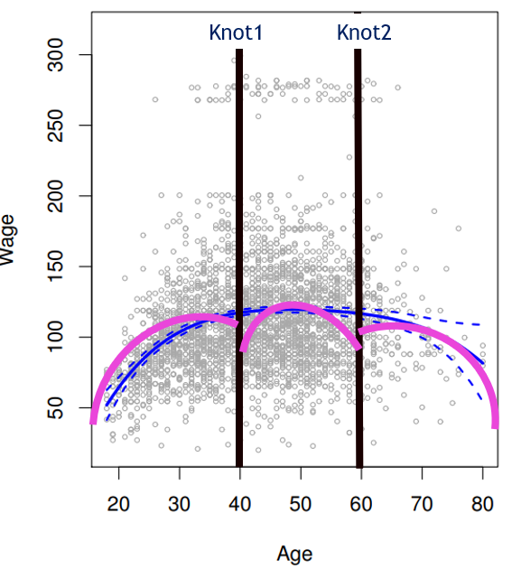

```{r setup, include=FALSE}
knitr::opts_chunk$set(echo = TRUE)
```

# Machine Learning 2 Summary Document {.tabset}

This document is a comprehensive summary for Machine Learning 2. It is intended to help us study for the exams and for future reference in our professional lives (if any companies actually use R).


## Forward and Backward Selection {.tabset}
Author: Matt Sadosuk

### Summary/description:


### When to employ this method/model:


### Model Code and Inputs:

```{r}

```

### Model Tests:

```{r}

```

### Model Improvements:

```{r}

```

### Comprehensive Example:

```{r}

```
--------------------------------------------------------------------------------


## Ridge Regression {.tabset}
Author: Sarah Brown

### Summary/description:
With this method, you shrink the B coefficients of your features towards 0. It reduces variance but increases bias in the training data. It doesn't let you make a coefficient 0 (it shrinks asymptotically) and so no features are eliminated. So, we use this when most features are useful and none seem irrelevant (if they did, you'd look at using lasso perhaps). As λ goes up, beta slope goes down and the line gets flatter which means the model is less sensative to the features. This means that the weight decay in gradient descent is larger.

### When to employ this method/model:
When the the training model is very accurate, but the test model is not, signaling that there is a large least squares error (high variance) in the test model. This means that the line is overfit to the training data. You want to minimize the the cost function which is: RSS + λ * (slope)^2 [penalty] where λ is the severity of the penalty, and is a tuning parameter. You can use ridge regression with:

Multiple regression
    λ(slope12 + slope22 + ….) (except for intercept)

Categorical X (binary)
    Slope = difference between the two categories

Logistic Regression
    Categorical Y
    Optimizes sum of likelihoods (rather than RSS)
*Multiple Regression thru Logistic Regression above, is directly out of Professor Li's Ppt

### Model Code and Inputs:

```{r,eval = F}
#First, divide the data into training and testing (in this case, its 75% training)
# (6) Create the train (75%) and test (25%) data sets 
train = sample(1:nrow(x), nrow(x)*.75)
test=(-train)
y.test=y[test]

#Create a grid of lambda valaues. Then use the glmnet() function to create a model to predict the #training y's using the training x's. Use alpha = 0 for ridge regression.
grid=10^seq(10,-3, length =120)
mod.ridge <- glmnet(x[train,], y[train], alpha=0, lambda =grid)
```

### Model Tests:

``` {r,eval = F}
#Evaluate training model performance (how well it predicted the y-values) by using cross-validation, which is the cv.glmnet() function. (In this example code, we are creating a 12-fold cross-validation model, but by default it is a 10-fold cv).
cv.out.ridge <- cv.glmnet(x[train,], y[train], alpha=0, lambda = grid, nfolds = 12)
plot(cv.out.ridge)
```

### Model Improvements:

``` {r,eval = F}
#Make predictions using the best model by using the best lambda. Create a vector of test set #predictions.
bestlam_r <- cv.out.ridge$lambda.min
ridge.pred <- predict(mod.ridge, s=bestlam_r, newx=x[test,])

#Compute and display the test error rate.
MSE_best_ridge<-mean((ridge.pred - y.test)^2) 
```

### Comprehensive Example:

```{r,eval = F}
#Part 1: Exploring ridge regression without using a test and train set
#Using the hitters data set, we set up the "x" and "y" matrix values so that we can use the glmnet function. 
x=model.matrix(Salary~.,HitData)[,-1]
y=HitData$Salary

#Make a grid of lambda values, and see how many coefficients you have and how many potential lambda #values there are.
grid=10^seq(10,-2,length=100)
ridge.mod=glmnet(x,y,alpha = 0,lambda = grid)
COEF<-coef(ridge.mod)
dim(COEF)
[1]  20 100 # 20 coefficients and 100 possible lambda values

#You can look at various lambda values and how they preform. Here is an example of looking at the #50th lambda value from the grid. 
ridge.mod$lambda[50]
[1] 11497.57
coef(ridge.mod)[,50]
  (Intercept)         AtBat          Hits         HmRun          Runs 
407.356050200   0.036957182   0.138180344   0.524629976   0.230701523 
          RBI         Walks         Years        CAtBat         CHits 
  0.239841459   0.289618741   1.107702929   0.003131815   0.011653637 
       CHmRun         CRuns          CRBI        CWalks       LeagueN 
  0.087545670   0.023379882   0.024138320   0.025015421   0.085028114 
    DivisionW       PutOuts       Assists        Errors    NewLeagueN 
 -6.215440973   0.016482577   0.002612988  -0.020502690   0.301433531 
sqrt(sum(coef(ridge.mod)[-1,50]^2))# Find the L2 value
[1] 6.360612

#Part 2: Predicting with a test and train set also using the hitters data
#Create test and train 
set.seed(1)
train<-sample(1:nrow(x),nrow(x)/2)
test=(-train)
y.test=y[test]

#To choose the best lambda value, we use cv.glmnet. We can find the best lambda and associated MSE.
set.seed(1)
cv.out=cv.glmnet(x[train,],y[train],alpha=0)
plot(cv.out)
bestlam<-cv.out$lambda.min
bestlam #326.0828
[1] 326.0828
ridge.pred<-predict(ridge.mod,s=bestlam,newx = x[test,])
mean((ridge.pred-y.test)^2) # 139856.6
[1] 139856.6

#We can also explore what the coefficients look like using the whole data set and our best lamda #value
out<-glmnet(x,y,alpha = 0)
predict(out,type = "coefficients",s=bestlam)[1:20,]
 (Intercept)        AtBat         Hits        HmRun         Runs          RBI 
 15.44383135   0.07715547   0.85911581   0.60103107   1.06369007   0.87936105 
       Walks        Years       CAtBat        CHits       CHmRun        CRuns 
  1.62444616   1.35254780   0.01134999   0.05746654   0.40680157   0.11456224 
        CRBI       CWalks      LeagueN    DivisionW      PutOuts      Assists 
  0.12116504   0.05299202  22.09143189 -79.04032637   0.16619903   0.02941950 
      Errors   NewLeagueN 
 -1.36092945   9.12487767 
# no coefficients are zero because in ridge regression they aren't allowed to be
```
--------------------------------------------------------------------------------


## Lasso Regression {.tabset}
Author: Jill Van den Dungen 

### Summary/description:


### When to employ this method/model:


### Model Code and Inputs:

```{r}

```

### Model Tests:

```{r}

```

### Model Improvements:

```{r}

```

### Comprehensive Example:

```{r}

```
--------------------------------------------------------------------------------


## Principal Component Regression {.tabset}
Author: Alex King

### Summary/description:


### When to employ this method/model:


### Model Code and Inputs:

```{r}

```

### Model Tests:

```{r}

```

### Model Improvements:

```{r}

```

### Comprehensive Example:

```{r}

```
--------------------------------------------------------------------------------


## Polynomial Regression {.tabset}
Author: Carrington Metts

### Summary/description:
Polynomial regression fits a polynomial curve to a set of data. It is analagous to linear regression, but allows greater flexibility 
to fit to data that does not have a linear relationship. 

### When to employ this method/model:
Polynomial regression should be used when there is a continuous response variable and one or more continuous features, 
and there is a nonlinear relationship between the X and Y variables. 

Polynomial regression may also be used to estimate a binary response variable, given a set of continuous features. 

### Model Code and Inputs:
A polynomial fit can be produced with either orthogonal or non-orthogonal terms. Having orthogonal polynomials means each 
term in the fit is a linear combination of each polynomial term (age^2, age^3, age^4, etc.) Non-orthogonal polynomials 
means the coefficients are reported directly. Both versions of orthogonality will result in the same fitted values. 
When creating models, it is best to always use orthogonal terms, since non-orthogonal terms are correlated with 
each other and therefore result in a multicollinearity problem. 

As with linear regression, we use lm() or glm() to create the fit. Within lm() or glm(), the poly() function automatically creates orthogonal
terms. The cbind() function can be used to create non-orthogonal terms. To create a model, we will use the Wage data (from ISLR) to predict
wage as a function of age. We can then use coef() to get the coefficients of the model. 

```{r poly_model, warning=FALSE}
library(ISLR)
#fit a degree-4 polynomial in 2 ways
orthogonal_fit <- lm(wage~poly(age,4), data=Wage)
summary(orthogonal_fit)

#2 identical methods for creating non-orthogonal terms
#When fitting real models, do NOT do this 
raw_fit <- lm(wage~cbind(age, age^2, age^3, age^4))
raw_fit2 <- lm(wage~poly(age,4, raw=TRUE), data=Wage)
summary(raw_fit)
summary(raw_fit2)

```

We can also create a polynomial regression model to predict whether a person will earn more than $250,000. To do so,
we use I() to coerce the continuous wage variable to binary categorical. We then run a glm fit on the model. 

```{r poly_binary_model}
binary_fit <- glm(I(wage>250)~poly(age, 4), data=Wage, family=binomial)
```


### Model Tests:
It is important to choose the lowest-degree model that adequately models the data. To do so, we use the ANOVA (analysis of variance)
test. ANOVA computes an F-test against two hypotheses: the null hypothesis, which states that a simple model is sufficient 
to explain the data, against a complex hypothesis, which states that a higher-order model is required. 

To determine the best model for the Wage data, we will create 5 different polynomial models and run ANOVA. 
```{r poly_tests}
library(ISLR)
fit.1 <- lm(wage~age, data=Wage)
fit.2 <- lm(wage~poly(age,2), data=Wage)
fit.3 <- lm(wage~poly(age,3), data=Wage)
fit.4 <- lm(wage~poly(age,4), data=Wage)
fit.5 <- lm(wage~poly(age,5), data=Wage)

anova(fit.1, fit.2, fit.3, fit.4, fit.5)

```

Here, we see that the p-values for fits 2 and 3 are less than 0.05, which means the models are significant. However, the p-value for 
fit 4 is 0.051046. This means the fourth model is not significantly better than the third model. Therefore, we should use the third-order model. 

### Model Predictions

```{r poly_improve}

```

### Comprehensive Example:

```{r poly_comprehensive}

```
--------------------------------------------------------------------------------


## Regression Splines {.tabset}
Author: Andrew Tremblay & Thomas Trankle

### Summary/description:

**Regression Splines** are more flexible than polynomials and step functions. 

This is because the are actually an extension of the two. 

They involve dividing the range of *X* into *K* distinct regions. Within each region, 
a polynomial function is fit to the data. However, these polynomials are constrained so that 
they **join smoothly at the region boundaries, or knots**. Provided that the interval is
divided into enough regions, this can produce an extremely flexible fit.

The points where the coefficients change are called *knots*.

In general, if we place *K* different knots throughout the range of *X*, then we
will end up fitting *K + 1* different polynomials.
```{r, echo = F}

```

To make it a continuous function we add constraints to the model.
Each constraint that we impose on the piecewise polynomials effectively frees up one
degree of freedom.

Remember, there are degrees of freedom for the entire model(Total DF) and the 
specified degrees of freedom for the polynomial (df).
 df = degree + knots
```{r, eval = F}
# Using the bs() function
bs(x , df = NULL, knots = NULL, degree = 3 #default
   intercept = False)
```

\centering
Total DF = 1 + df = 1 + degree + knots

### When to employ this method/model:

Instead of fitting a high-degree polynomial over the entire range of *X*, *piecewise
polynomial regression* involves fitting separate low-degree polynomials over different 
regions of *X*.

We use this model when we need a high degree of flexibility.

Using more knots leads to a more flexible piecewise polynomial.


### Model Code and Inputs:

```{r}

```

### Model Tests:

```{r}

```

### Model Improvements:

```{r}

```

### Comprehensive Example:

```{r}

```
--------------------------------------------------------------------------------


## Smoothing Splines {.tabset}
Author: Emma Harrison

### Summary/description:
A smoothing spline is a natural cubic spline with a knot at every x. Can achieve perfect fit (RSS of 0) by going through every data point. 
Want a function that makes RSS small, but keeps the line smooth. Ensure that it’s smooth by: minimizing the tuning parameter. 

### When to employ this method/model:
One of the 4 non-linear model options. 
lots of flexibility
lots of degrees of freedom (one @ each knot = sample size n)

### Model Code and Inputs:

```{r,eval = F}
(9) Now let's fit smoothing splines with cross-validation
regression_fit=smooth.spline(x,y,df=12)   #use the first fit to set df
smooth_fit=smooth.spline(x,y, cv=TRUE)  #fits the training data with LOOCV
df= Degrees of freedom
cv= cross validation
(10) Display number of degrees of freedom in the cross-validated smoothing spline.
smooth_fit$df   #df produces splines at uniform knots

```

### Model Tests:

```{r,eval = F}
(11) Use the best model to predict y-values for the 50 new x's from step (7) above
ylims=range(y)
vector1<-seq(from=ylims[1],to=ylims[2], length.out = 50)
Visually inspect the plot of predicted values against X values
(12)	Plot the full sample's x's and y's.
xlims=range(x)
plot(x,y,xlim=xlims, ylim=ylims,cex=.5,col="darkgrey")
title("Smoothing Spline")

```

### Model Improvements:

```{r,eval = F}
N/A... would just use a different model
```

### Comprehensive Example:

```{r,eval = F}
> library(splines)
> fit=lm(wage∼bs(age ,knots=c(25,40,60) ),data=Wage)
> pred=predict (fit ,newdata =list(age=age.grid),se=T)
> plot(age ,wage ,col="gray")
> lines(age.grid ,pred$fit ,lwd=2)
> lines(age.grid ,pred$fit +2*pred$se ,lty="dashed ")
> lines(age.grid ,pred$fit -2*pred$se ,lty="dashed ")
> fit2=lm(wage∼ns(age ,df=4),data=Wage) 
> pred2=predict (fit2 ,newdata=list(age=age.grid),se=T)
> lines(age.grid , pred2$fit ,col="red",lwd=2)
> plot(age ,wage ,xlim=agelims ,cex =.5,col=" darkgrey ") 
> title("Smoothing Spline ") > fit=smooth .spline(age ,wage ,df=16) 
> fit2=smooth.spline (age ,wage ,cv=TRUE) 
> fit2$df
> lines(fit ,col="red",lwd =2)
> lines(fit2 ,col="blue",lwd=2) 
> legend ("topright ",legend=c("16 DF" ,"6.8 DF"), col=c("red","blue"),lty=1,lwd=2, cex =.8)

```
--------------------------------------------------------------------------------


## Local Regression {.tabset}
Author: Kayleigh Gillis

### Summary/description:


### When to employ this method/model:


### Model Code and Inputs:

```{r}

```

### Model Tests:

```{r}

```

### Model Improvements:

```{r}

```

### Comprehensive Example:

```{r}

```
--------------------------------------------------------------------------------


## GAM {.tabset}
Author: Akram Bijapuri

### Summary/description:


### When to employ this method/model:


### Model Code and Inputs:

```{r}

```

### Model Tests:

```{r}

```

### Model Improvements:

```{r}

```

### Comprehensive Example:

```{r}

```
--------------------------------------------------------------------------------


## Tree Classification and Regression {.tabset}
Author: Ian Lawson 

### Summary/description:


### When to employ this method/model:


### Model Code and Inputs:

```{r}

```

### Model Tests:

```{r}

```

### Model Improvements:

```{r}

```

### Comprehensive Example:

```{r}

```
--------------------------------------------------------------------------------


## Bagging and Random Forest {.tabset}
Author: Witty Wittyngham

### Summary/description:


### When to employ this method/model:


### Model Code and Inputs:

```{r}

```

### Model Tests:

```{r}

```

### Model Improvements:

```{r}

```

### Comprehensive Example:

```{r}

```


