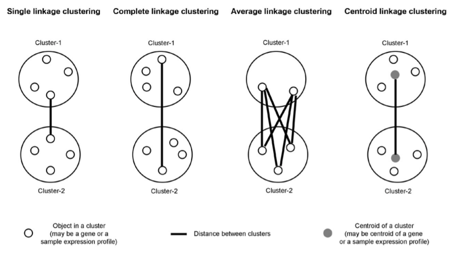

```{r setup, include=FALSE}
knitr::opts_chunk$set(echo = TRUE)
```

# Machine Learning 2 Summary Document {.tabset}

This document is a comprehensive summary for Machine Learning 2. It is intended to help us study for the exams and for future reference in our professional lives (if any companies actually use R).

## Basic Statistics {.tabset}
Authors: Carrington Metts & Thomas Trankle

### Bias/Variance Tradeoff
**Variance** is defined as the amount by which a prediction would vary if it were estimated with a different training set. A model with high variance is *overfit*- small 
changes in the training set may result in large changes to the model. 

**Bias** is defined as the amount of error that is due to reducing a complex real-world dataset to a simple model. A model with high bias is *underfit*- changes in the 
training set are unlikely to significantly change the model, but the model still does not make good predictions for the data. 

If your training error is low and test error is high, the model has *high variance*. If both the training and testing errors are high, the model has 
*high bias*. If both the training and testing errors are low, the model has *low variance and low bias*. 

### Law of Parsimony
* Occam's razor
* Simpler Model is always better than complex model
* Only keep features that truly add substance to the model
* Avoid **overfitting** the model
  + Unimportant/irrelevant features overcomplicate model
  + Highly correlated features overcomplicate model (multicollinearity)
  + Interaction terms, polynomial terms, interaction with polynomials, etc.  models get complicated very quickly!

### Stats Formula's
Training set MSE = an underestimate of test MSE

MSE = RSS /n

Least squares method minimizes training not testing MSE

We can estimate test error indirectly by adjusting training error:

* $C_{P} = \frac{1}{n}(RSS + 2d\hat{\sigma}^{2})$
  + Smaller $C_{p}$ value = smaller test error
  + Select model with smaller $C_{P}$
  + second term is the penalty factor for having more features
* $\textbf{AIC} = \frac{1}{n\hat{\sigma}^2}(RSS + 2d\hat{\sigma}^{2})$
* $\textbf{BIC} = \frac{1}{n\hat{\sigma}^2}(RSS + log(n)\hat{\sigma}^{2})$
* $\textbf{Adjusted R}^2 = 1 - \frac{RSS/(n-d-1)}{TSS/(n-1)}$
  + Smaller adjusted $R^{2}$ = larger test error
  + Regular R2 is just RSS/TSS

where 

$\hat{\sigma}^2$ = residual variance estimated using full model 

d = # of features used in the subset

### Shrinkage/Regularization
We generally have a problem when $n$ < $p$

This creates low bias and high variance issue

The solution to this is Regularization (shrinkage; desensitization)

* Instead of fitting a model with all predictors (Xs)
* Shrink (regularize; constrain) β coefficients towards zero
* **NB**: This reduces **variance** but increases **bias**

Generally, we do this with either feature selection, ridge or lasso.

With regularization, we are adding a penalty to our objective function:

* Linear = minimize RSS
* Ridge = minimize RSS + $\lambda \times \text{slope}^2$ [penalty]
* Lasso = minimize RSS + $\lambda \times |\text{slope}|$ [penalty]

Overall, when we increase $\lambda$, we decrease the size of the slope/coefficients of
certain beta's

When $\lambda$ $\uparrow$

* Beta slope $\downarrow$
* the line gets flatter which means the label is less sensitive to the features
* weight decay in gradient descent is larger 

l2norm is a value between 0 and 1 (ratio od ridge vs LS estimates)

$$\frac{||\hat{\beta}^{R}_{\lambda}||_{2}}{||\hat{\beta}||_{2}} = 
\frac{\text{Betas estimated using ridge}}{\text{Betas estimated using least squares}}$$

Ridge vs. Lasso

* Use Ridge when most features in the model are useful (according to literature, theory, expertise, or common sense)

* Use Lasso when we suspect that the model includes a lot of useless features
  + Lasso helps us determine which features are useless (with zero slope)
  + Lasso selects variables (similar to subset selection)
  + Lasso model is sparse = easier to interpret than Ridge model

Additional Considerations:

* Coefficient estimates are sensitive to scaling
  + Standardize predictors before using regularization
* Estimates a line when n < p
* Works best when LS regression produces high variance
* Computationally feasible alternatives to subset selection

--------------------------------------------------------------------------------

## Forward and Backward Selection {.tabset}
Author: Matt Sadosuk

### Summary/description:

For forward stepwise selection, the model begins with no variables, then starts
adding the most significant variables until a pre-specified stopping rule is reached.

Backward stepwise selection begins with a model that contains all variables, then starts removing the least significant variables until a 
pre-specified stopping rule is reached or until no variable is left in the model


### When to employ this method/model:
Forward and backward selection will be used when you're trying to identify which
combination of features that will produce the best model.

This R script will cover how to use Forward and Backward selection to identify which model is the best.
As well it will feature a validation process to identify how close the results were before performing the test
on the data set.

### Model Code and Inputs:
Using the library mass, use the Boston dataset which is about the housing suburbs of the Boston area. The Boston dataset has 13 features. 
```{r}
library(MASS)
data(Boston)
length(Boston)
```

The next step involves subsetting the data through the function regsubset from the library (leaps).
First we need to perform the test without forward and backward selection to see how the model looks.
Then to note for the code we will use medv (median value of owner-occupied homes in $1000s) as our Y-var.
The argument nvmax specifies the maximum number of subsets that will be considered. We can use method= to 
specify forward or backward selection; otherwise, the default is full subset selection. 

```{r}
library(leaps)

regfit.full=regsubsets(medv~.,data=Boston ,nvmax=13)
reg.summary =summary(regfit.full)

regfit.fwd=regsubsets(medv~.,data=Boston , nvmax=13, method ="forward")
summary(regfit.fwd)

regfit.bwd=regsubsets(medv~.,data=Boston , nvmax=13, method ="backward")
summary(regfit.bwd)

```
The summary() function returns * if a given variable is included in the model. It is sorted by model size; the first
row is the best 1-feature model, the second row is the best 2-feature model, etc.

The summary object stores the R squared values for each model:
``` {r}
reg.summary$rsq 
```

To see the coefficients of a model, use the coef() function. Let's try it with the 7-variable model: 


```{r}
coef(regfit.full ,7)
coef(regfit.fwd ,7)
coef(regfit.bwd ,7)
```

### Model Tests:
In order for these approaches to yield accurate estimates of the test
error, we must use only the training observations to perform all aspects of
model-fitting—including variable selection. Therefore, the determination of
which model of a given size is best must be made using only the training
observations. 

Now we split the training and test data using a sample vector of True and False items. 
A True value means the item is in the training set; otherwise it will be False. 
In the test line we use the !train to switch the true and false values for the 
test dataset. 

```{r}
set.seed(1)
train=sample(c(TRUE ,FALSE), nrow(Boston),rep=TRUE)
test=(!train)
```

Following the splitting of data into the test and training set we now want to 
select the the best subset. We do this by now using Boston[train,] which
is new sample vector of true and false values. We are still using a nvmax of 13 (which means
we will examine a maximum of 13 subsets). 

```{r}
regfit.best=regsubsets(medv~.,data=Boston[train ,],nvmax=13)
```

Next we will get the validation error for the best model size by creating a model
matrix for the test data. The model.matrix() function builds an X matrix from the data

```{r}
test.mat=model.matrix(medv~.,data=Boston[test ,])
```

Next we create a for loop that takes each size i and will be extract the coefficients
from the variable regfit.best, then multiply the coef into the appropriate columns
for the test model matrix to make predictions and compute the test MSE

First we create a empty vector from 1 to 13. Inside the for loop, we  calculate coefficient of each i, 
then make predictions from those coefficients. 
Finally, we calculate the test MSE and store it in the empty vector.
```{r}
val.errors = rep(0,13)
for(i in 1:13){
  coefi=coef(regfit.best ,id=i)
  pred=test.mat[,names(coefi)]%*%coefi
  val.errors[i]=mean((Boston$medv[test]-pred)^2)
}
val.errors
```

We now use the which min to see what is the best amount of variables to use
```{r}
which.min(val.errors)
```
Here, we see that the 11-feature model works best. 

We can also perform cross-validation to directly determine the test error rate. 
Unfortunately, there is no predict() function for regsubset. Instead, we'll write our own: 

```{r}
predict.regsubsets =function (object , newdata ,id ,...){
 form=as.formula (object$call [[2]])
 mat=model.matrix(form ,newdata )
 coefi=coef(object ,id=id)
 xvars=names(coefi)
 mat[,xvars]%*%coefi
}
```

Now we want to choose among models with different sizes using a 10-fold cross validation method.
We want to perform the best subset selection within each of the 10 training sets.
 Finally we will create a matrix to store the store the results.

```{r}
k=10
set.seed(1)
folds=sample(1:k,nrow(Boston),replace=TRUE)
cv.errors= matrix(NA,k,13, dimnames = list(NULL, paste(1:13)))
```

Now we can perform the cross validation through nested for loops. The first loop 
(with j) iterates over each of the 10 folds as a test set. After this, we use another loop to make model
predictions (using our new predict.regsubsets() function) and then calculate the test error rates for the subsetted data. 
We then add the CV error to the matrix. The result is a 10x13 matrix, where the (i, j)th element 
corresponds to the MSE for the ith fold for the model with *j* predictors.

```{r}
k <- 10
for(j in 1:k){
 best.fit <- regsubsets(medv~.,data=Boston[folds!=j,],nvmax=13)
 for(i in 1:13){
  pred=predict.regsubsets(best.fit ,Boston[folds ==j,],id=i)
  cv.errors[j,i]= mean((Boston$medv[ folds==j]-pred)^2)
  }
}
```

Now we determine the average error for each model. We use apply() to average over each column.
```{r}
mean.cv.errors=apply(cv.errors ,2, mean)
mean.cv.errors

par(mfrow=c(1,1))
plot(mean.cv.errors ,type="b")
```

After doing the CV on the Boston data set we can conclude that the 11 variable model
is the best fit.

To get the coefficients for the final model:
```{r}
bestModel <- regsubsets(medv~., data=Boston, nvmax=13)
coef(bestModel, 11)
```

--------------------------------------------------------------------------------

## Ridge Regression {.tabset}
Author: Sarah Brown

### Summary/description:
With this method, you shrink the Beta coefficients of your features towards 0. 
It reduces variance but increases bias in the training data. 
It doesn't let you make a coefficient 0 (it shrinks asymptotically) and so no features are fully eliminated. 
So, we use this when most features are useful and none seem irrelevant (if they did, you'd look at using lasso perhaps). 
As λ goes up, beta slope goes down and the line gets flatter which means the model is less sensitive to the features. 
This means that the weight decay in gradient descent is larger.

### When to employ this method/model:
When the the training model is very accurate, but the test model is not, signaling that there is a large least 
squares error (high variance) in the test model. This means that the line is overfit to the training data. You want to 
minimize the the cost function which is: RSS + λ * (slope)^2 [penalty] where λ is a tuning parameter that indicates the severity of the penalty. 
When λ is very high, all coefficients are driven to 0. When λ is equal to 0, there is no effect, so the function is fit with least squares. 

Ridge regression often considers the L2 norm, which is the sum of the squares of all coefficients. In particular, it is common to make 
plots where one axis is equal to the L2 norm with ridge regression divided by the L2 norm with least squares. When this ratio is close to 0, 
the coefficients with ridge regression take very small values (i.e. λ is very large). When this ratio is 1, the results of ridge regression and least squares 
are the same (i.e. λ is small). 

According to Dr. Chung's PowerPoint, you can use ridge regression with:

Multiple regression
    $λ(slope12 + slope22 + \dots)$ (except for intercept)

Categorical X (binary)
    $Slope = \textit{difference between the two categories}$

Logistic Regression
    Categorical Y
    Optimizes sum of likelihoods (rather than RSS)

### Model Code and Inputs:

```{r}
library(ISLR)
library(glmnet)
data(Hitters)
Hitters <- na.omit(Hitters)
x=model.matrix(Salary~.,Hitters)[,-1]
y=Hitters$Salary

#First, divide the data into training and testing (in this case, its 75% training)
# (6) Create the train (75%) and test (25%) data sets 
train = sample(1:nrow(x), nrow(x)*.75)
test=(-train)
y.test=y[test]

#Create a grid of lambda valaues. Then use the glmnet() function to create a model to predict the #training y's using the training x's. Use alpha = 0 for ridge regression.
grid=10^seq(10,-2,length=100)
mod.ridge <- glmnet(x[train,], y[train], alpha=0, lambda =grid)
```

### Model Tests:

``` {r}
#Evaluate training model performance (how well it predicted the y-values) by using cross-validation, which is the cv.glmnet() function. (In this example code, we are creating a 12-fold cross-validation model, but by default it is a 10-fold cv).
cv.out.ridge <- cv.glmnet(x[train,], y[train], alpha=0, lambda = grid, nfolds = 12)
plot(cv.out.ridge)
```

### Model Improvements:

``` {r}
#Make predictions using the best model by using the best lambda. Create a vector of test set #predictions.
bestlam_r <- cv.out.ridge$lambda.min
ridge.pred <- predict(mod.ridge, s=bestlam_r, newx=x[test,])

#Compute and display the test error rate.
MSE_best_ridge<-mean((ridge.pred - y.test)^2) 
```

### Comprehensive Example:

```{r}
#Part 1: Exploring ridge regression without using a test and train set
#Using the hitters data set, we set up the "x" and "y" matrix values so that we can use the glmnet function. 
x=model.matrix(Salary~.,Hitters)[,-1]
y=Hitters$Salary

#Make a grid of lambda values, and see how many coefficients you have and how many potential lambda #values there are.
grid=10^seq(10,-2,length=100)
ridge.mod=glmnet(x,y,alpha = 0,lambda = grid)
COEF<-coef(ridge.mod)
dim(COEF)
```


You can look at various lambda values and how they perform. Here is an example of looking at the #50th lambda value from the grid. 

```{r}
ridge.mod$lambda[50]

coef(ridge.mod)[,50]

sqrt(sum(coef(ridge.mod)[-1,50]^2))# Find the L2 value
```

```{r}

#Part 2: Predicting with a test and train set also using the hitters data
#Create test and train 
set.seed(1)
train<-sample(1:nrow(x),nrow(x)/2)
test=(-train)
y.test=y[test]

#To choose the best lambda value, we use cv.glmnet. We can find the best lambda and associated MSE.
set.seed(1)
cv.out=cv.glmnet(x[train,],y[train],alpha=0)
plot(cv.out)
bestlam<-cv.out$lambda.min
bestlam #326.0828

ridge.pred<-predict(ridge.mod,s=bestlam,newx = x[test,])
mean((ridge.pred-y.test)^2) # 139856.6


#We can also explore what the coefficients look like using the whole data set and our best lamda #value
out<-glmnet(x,y,alpha = 0)
predict(out,type = "coefficients",s=bestlam)[1:20,]

# no coefficients are zero because in ridge regression they aren't allowed to be
```
--------------------------------------------------------------------------------


## Lasso Regression {.tabset}
Author: Jill Van den Dungen 

### Summary/description:
Lasso is an alternative to the ridge regression. The cost function for lasso regression is  RSS + λ * abs(slope). Here, the penalty 
term is determined by the absolute value of the coefficients instead of the square. This has the effect of forcing some of the coefficients 
estimates to be exactly equal to zero when the tuning parameter lambda is sufficiently large. Therefore, some variables 
are eliminated. Models generated from lasso are sparse = they are easier to interpret than the models by ridge regression. 

### When to employ this method/model:
Use lasso when we suspect that the model includes a lot of useless features. 


### Model Code and Inputs:

```{r, eval =F}
#Create the train (75%) and test (25%) data sets 
train<-sample(1:nrow(x), nrow(x)*0.75)
test<- (-train)
y_test=y[test]

#Create a lamba grid vector of 120 elements ranging from 10^10 to 10^-3 
grid=10^seq(10,-3,length=120)

#Using the glmnet() function, create a lasso model named mod.lasso that predicts the training y's using the training x's and the grid of lambda values created above.

mod.lasso<-glmnet(x[train,],y[train],alpha = 1,lambda = grid)

```

### Model Tests:

```{r,eval =F}
#Evaluate training model performance using cross-validation
#Using the cv.glmnet() function and the same parameters used above in the creation of mod.lasso (i.e. including the lambda grid vector),
#     create a 12-fold cross-validation model named cv.out.lasso

cv.out.lasso<-cv.glmnet(x[train,],y[train],alpha = 1,lambda = grid, nfolds=12)
plot(mod.lasso)
```

### Model Improvements:

```{r,eval =F}
#Display the best cross-validated lambda value (the one that produces the lowest deviance - do not use the 1-standard error rule here).
bestlam<-cv.out.lasso$lambda.min

#Using the best lambda and the model named mod.lasso, create a vector of test set predictions.
lasso.pred<- predict(mod.lasso, s=bestlam, newx= x[test,])

#Compute and display the test error rate.
mean((lasso.pred-y_test)^2)
```

### Comprehensive Example:

```{r,eval =F}
library(ISLR)
data(Hitters)
Hitters <- na.omit(Hitters)
#Using the hitters data set, we set up the "x" and "y" matrix values so that we can use the glmnet function. 
x=model.matrix(Salary~., data=Hitters)[,-1]
y=Hitters$Salary

#Make a grid of lambda values
grid=10^seq(10,-2,length=100)

#Create test and train 
set.seed(1)
train<-sample(1:nrow(x),nrow(x)/2)
test=(-train)
y.test=y[test]

#Create lasso model using train set
lasso.mod<-glmnet(x[train,],y[train], alpha=1, lambda= grid)
plot(lasso.mod)

#Create cross validation model
set.seed(1)
cv.out<-cv.glmnet(x[train, ], y[train], alpha=1)
plot(cv.out)

#Create best lambda and make predictions
bestlam<- cv.out$lambda.train
bestlam

lasso.pred<-predict(lasso.mod, s=bestlam, newx= x[test,])
mean((lasso.pred-y.test)^2)

#explore whole data set to see what best lambda is
out=glmnet(x,y,alpha= 1, lambda= grid)
lasso.coef<- predict(out, type= 'coefficients', s=bestlam)[1:20,]
lasso.coef

```
--------------------------------------------------------------------------------


## Principal Component Regression {.tabset}
Author: Alex King

### Summary/description:

Principal Components Analysis (PCA): Popular Algorithm for deriving a low-dimensional set of features from a large set of features from a large set of variables. This is done by transforming X features through linear combinations
	
There are two methods:

Principal Components Regression/Analysis
Partial Least Squares

Both involve supervised regression of Y on components. However, PCR is the unsupervised identification of components in the X feature space, while PLS is supervised.

PLS and PCR have very similar performances.


### When to employ this method/model:

Uses: 
1) When there are more variables than observation (wide data)
Shopping Behavior (Y) and Search Keywords
2) When the explanatory variables are highly correlated
3) Use PLS when you want to reduce bias

Potential Drawbacks: There is no guarantee that the selected principal components are associated with the outcome. If there is no correlation with the variables, you will run into trouble. PLS can also increase variance


### Model Code and Inputs:
Library: PLS

PCR: pcr(Y~X, data=DF,scale=TRUE,validation= “cv”)
PLS: plsr(Y~X,data=df,scale=TRUE,validation= “cv”)


### Model Tests:

 For the model tests, we will use the Validation Plot Function. This function allows you to graph show the Mean Square Error of Prediction versus the # of Components. You will choose the number of components that has the lowest MSEP.

validationplot(pcr.fit, val.type="MSEP")


### Model Improvements:
Adjust nComp which is the number of principal components to build the models for. Adding Scale = True

### Comprehensive Example:

```{r}
#### PCR

### Step 1: Load Require Packages
library(tidyverse)
library(caret)
library(pls)

### Step 2: Load Data Set the Data
library(MASS)
data("Boston")
str(Boston)

### Step 3: Split Dataset
set.seed(123)
training.indices <- Boston$medv %>% createDataPartition(p=0.8,list=FALSE)
train <- Boston[training.indices,]
test <- Boston[-training.indices,]
y.test <- test$medv

### Step 4: Compute PCR

# Build Model
model <- pcr(medv~.,data=Boston,subset=training.indices,scale=TRUE,validation="CV")
summary(model)

validationplot(model,val.type = "MSEP")


### Calculate Lowest MSE
pcr.pred = predict(model,test,ncomp=13)
mean((pcr.pred-y.test)^2)
# MSE = 21.05844

### Test on whole Dataset
model.whole <- pcr(medv~.,data=Boston,scale=TRUE,validation="CV")
pcr.pred = predict(model.whole,test,ncomp=13)
mean((pcr.pred-y.test)^2)
# MSE = 19.934

##### PLS
### Steps 1-3 Same as PCR
pls.fit <- plsr(medv~.,data=Boston,subset=training.indices, scale=TRUE,validation="CV")
summary(pls.fit)

validationplot(pls.fit,val.type="MSEP")

pls.pred <- predict(pls.fit,test,ncomp=8)
mean((pls.pred-y.test)^2)
# MSE = 20.95983

### Whole Dataset
pls.whole <- plsr(medv~.,data=Boston, scale=TRUE,validation="CV")
pls.pred <- predict(pls.whole,test,ncomp=8)
mean((pls.pred-y.test)^2)
# MSE = 19.90098
```
--------------------------------------------------------------------------------


## Polynomial Regression {.tabset}
Author: Carrington Metts

### Summary/description:
Polynomial regression fits a polynomial curve to a set of data. It is analagous to linear regression, but allows greater flexibility 
to fit to data that does not have a linear relationship. 

### When to employ this method/model:
Polynomial regression should be used when there is a continuous response variable and one or more continuous features, 
and there is a nonlinear relationship between the X and Y variables. 

Polynomial regression may also be used to estimate a binary response variable, given a set of continuous features. 

### Model Code and Inputs:
A polynomial fit can be produced with either orthogonal or non-orthogonal terms. Having orthogonal polynomials means each 
term in the fit is a linear combination of each polynomial term (age^2, age^3, age^4, etc.) Non-orthogonal polynomials 
means the coefficients are reported directly. Both versions of orthogonality will result in the same fitted values. 
When creating models, **it is best to always use orthogonal terms**, since non-orthogonal terms are correlated with 
each other and therefore result in a multicollinearity problem. 

As with linear regression, we use lm() or glm() to create the fit. Within lm() or glm(), the poly() function automatically creates orthogonal
terms. (To create non-orthogonal terms, you can use the cbind() function, or set raw=True inside poly()). To create a model, we will use the Wage data (from ISLR) to predict
wage as a function of age. We can then use coef() to get the coefficients of the model. 

```{r poly_model, warning=FALSE}
library(ISLR)
#fit a degree-4 polynomial in 2 ways
orthogonal_fit <- lm(wage~poly(age,4), data=Wage)
summary(orthogonal_fit)

```

We can also create a polynomial logistic regression model to predict whether a person will earn more than $250,000. To do so,
we use I() to coerce the continuous wage variable to binary categorical. We then run a glm fit on the model. 

```{r poly_binary_model}
logistic_fit <- glm(I(wage>250)~poly(age, 4), data=Wage, family=binomial)
```


### Model Tests:
It is important to choose the lowest-degree model that adequately models the data. To do so, we use the ANOVA (analysis of variance)
test. ANOVA computes an F-test against two hypotheses: the null hypothesis, which states that a simple model is sufficient 
to explain the data, against a complex hypothesis, which states that a higher-order model is required. 

To determine the best model for the Wage data, we will create 5 different polynomial models and run ANOVA. 
```{r poly_tests}
library(ISLR)
fit.1 <- lm(wage~age, data=Wage)
fit.2 <- lm(wage~poly(age,2), data=Wage)
fit.3 <- lm(wage~poly(age,3), data=Wage)
fit.4 <- lm(wage~poly(age,4), data=Wage)
fit.5 <- lm(wage~poly(age,5), data=Wage)

anova(fit.1, fit.2, fit.3, fit.4, fit.5)

```

Here, we see that the p-values for fits 2 and 3 are less than 0.05, which means the models are significant. However, the p-value for 
fit 4 is 0.051046. This means the fourth model is not significantly better than the third model. Therefore, we should use the third-order model. 

The effectiveness of a polynomial regression model may be determined by R^2, MSE, or any other regression error metric. For polynomial logistic regression,
we typically determine the output classes based on the predicted probabilities and compute the accuracy rate: 

```{r eval=FALSE}
predictedClasses = ifelse ( outputProb > .5, "Yes" , "No" )
table(predictedClasses, actualClasses)

```

### Model Predictions
#### Polynomial Regression
Now that we have chosen model 3, let's use it to predict wage for some new list of ages. We'll first create a new set of ages to feed to the model. 
Then, we'll use the predict() function to calculate the predictions. 
```{r poly_predict}
agelims  = range(Wage$age) #pull out minimum and maximum ages
age.grid = seq(from=agelims[1], to=agelims[2]) #create a list of ages from the smallest to largest age 
preds    = predict(fit.3, newdata=list(age=age.grid), se=TRUE) #make predictions on the new list of ages 
```

Now, we want to determine the 95% confidence interval for our predictions, which corresponds to 2 standard deviations in each direction. 
```{r poly_conf}
se.bands = cbind(preds$fit+2*preds$se.fit, preds$fit-2*preds$se.fit)
```

We can now plot the data, prediction, and confidence interval: 
```{r poly_plot}
par(mfrow=c(1,2), mar=c(4.5,4.5,1,1), oma=c(0,0,4,0))
plot(Wage$age, Wage$wage, xlim=agelims, cex =.5, col="darkgrey ") #data
title("Degree-3 Polynomial",outer=T)
lines(age.grid, preds$fit, lwd=2, col="blue") #predictions
matlines(age.grid, se.bands, lwd=1, col=" blue", lty=3) #confidence interval
```

#### Polynomial Logistic Regression
The glm() function automatically returns predictions in logit form, so we need to transform them to the actual values (ie probabilities that 
range from 0 to 1, as we expect).
Other than that, the predictions and confidence intervals are computed and plotted in the same way. 

```{r poly_logistic_predict}
logist_preds = predict(logistic_fit,newdata=list(age=age.grid),se=T) #make predictions

#transform predictions from logit form 
pfit = exp(logist_preds$fit)/(1+exp(logist_preds$fit))

#compute confidence intervals and transform from logit form 
se.bands.logit = cbind(logist_preds$fit +2* logist_preds$se.fit , logist_preds$fit -2*logist_preds$se.fit)
se.bands = exp(se.bands.logit)/(1+exp(se.bands.logit))

#plot data, fit, confidence band
plot(Wage$age ,I(Wage$wage >250),xlim=agelims ,type="n",ylim=c(0,.2)) #data

#add a jitter to the points so they don't overlap each other (just for aesthetics)
points(jitter(Wage$age), I((Wage$wage >250)/5),cex=.5,pch ="|", col="darkgrey")

#prediction
lines(age.grid ,pfit ,lwd=2, col ="blue")

#confidence interval
matlines (age.grid ,se.bands ,lwd=1, col="blue",lty=3)
```

### Comprehensive Example:

#### Polynomial Regression
``` {r poly_full}
#run anova to pick best model (degree 1-5)
fit.1 <- lm(wage~age, data=Wage)
fit.2 <- lm(wage~poly(age,2), data=Wage)
fit.3 <- lm(wage~poly(age,3), data=Wage)
fit.4 <- lm(wage~poly(age,4), data=Wage)
fit.5 <- lm(wage~poly(age,5), data=Wage)

anova(fit.1, fit.2, fit.3, fit.4, fit.5)

#fit.3 is the best, according to anova 
#create vector of new ages to make predictions on 
agelims  = range(Wage$age)
age.grid = seq(from=agelims[1], to=agelims[2])

#make predictions 
preds    = predict(fit.3, newdata=list(age=age.grid), se=TRUE)

#compute confidence interval
se.bands = cbind(preds$fit+2*preds$se.fit, preds$fit-2*preds$se.fit)

#plot data, fit, 95% confidence interval
par(mfrow=c(1,1), mar=c(4.5,4.5,1,1), oma=c(0,0,4,0))
plot(Wage$age, Wage$wage, xlim=agelims, cex =.5, col="darkgrey ") #data
title("Degree-3 Polynomial",outer=T)
lines(age.grid, preds$fit, lwd=2, col="blue") #fit 
matlines(age.grid, se.bands, lwd=1, col=" blue", lty=3) #confidence interval
````

#### Polynomial Logistic Regression
```{r poly_logistic_full}
#create the model 
logistic_fit <- glm(I(wage>250)~poly(age, 4), data=Wage, family=binomial)

#make predictions for new data (returns probabilities in logit form)
logist_preds = predict(logistic_fit,newdata=list(age=age.grid),se=T)

#transform probabilities from logit form to normal (ie probabilities that go from 0 to 1, as we expect)
pfit = exp(logist_preds$fit)/(1+exp(logist_preds$fit))

#find the 2-standard-deviation confidence intervals 
se.bands.logit = cbind(logist_preds$fit +2* logist_preds$se.fit , logist_preds$fit -2*logist_preds$se.fit)

#transform confidence intervals from logit to normal form 
se.bands = exp(se.bands.logit)/(1+exp(se.bands.logit))

#plot the data points, apply a jitter so they aren't on top of each other 
plot(Wage$age ,I(Wage$wage >250),xlim=agelims ,type="n",ylim=c(0,.2))
points(jitter(Wage$age), I((Wage$wage >250)/5),cex=.5,pch ="|", col="darkgrey")

#plot the predicted values (age.grid and the Y predictions)
lines(age.grid ,pfit ,lwd=2, col ="blue")

#plot the confidence intervals 
matlines (age.grid ,se.bands ,lwd=1, col="blue",lty=3)

```

--------------------------------------------------------------------------------

## Step Functions{.tabset}
Author: Alex Russett

### Summary and Description

In general **step functions** allow you to fit different areas of your data to different constant functions that
will allow them to fit the data better overall. This is stated in the book as avoiding imposing a 
**global structure** on data, and to instead break the data into **bins**, allowing us to fit a different constant to each bin.

To do this, we create cut points C(1), C(2)... ,C(k) in the range of X, then construct K+! new variables. 

You can see example pictures on page 269 in chapter 7.2 of ISLR

### When do we use step functions? 

Step functions should ONLY be used when there are very natural and easy to identify break points 
in the X range of the data. They are commonly used with categorical features. 

Step Functions are commonly used among Neural Networks as well.


### Model Code and Inputs:

#### Basics - Sample code not designed to be run

```{r, eval = F}
# Fitted Step function
lm(Y ~ cut(X,4))
# Fitted Logistic Regression
glm(Y ~ cut(X,4))
```
The above code chunk is choosing the data, and then the number of splits to employ! This is the entire applicaiton of the 
step function. 

Here it is in context!

### Full Comprehensive Example

This example uses an LM function, but I will highlight when it fits a step function for analysis! 
```{r}
# Load library and attach data set
rm(list=ls())
library(ISLR)
attach(Wage)
```

```{r}
#using the lm() function, in order to predict
#wage using a fourth-degree polynomial in age: poly(age,4). The poly() command allows us to avoid having to write out a long formula with powers of age.
fit=lm(wage~poly(age ,4) ,data=Wage)
coef(summary(fit))
```

```{r}
#We can use poly() to obtain age, age^2, age^3, and age^4, if we prefer. We do this by adding the raw=TRUE argument to the poly() function
fit2 = lm(wage~poly(age,4,raw=T),data=Wage)
coef(summary(fit2))
```
```{r}
# There are a few other ways to fit the model, showing the flexibility of the formula language in R:
fit2a = lm(wage~age+I(age^2)+I(age^3)+I(age^4),data=Wage)
coef(fit2a)

fit2b = lm(wage~cbind(age,age^2,age^3,age^4),data=Wage)
coef(fit2b)
```
```{r}
#We now create a grid of values for age at which we want predictions, and then call the generic predict() function, specifying that we want standard errors as well
agelims =range(age)
age.grid=seq(from=agelims [1],to=agelims [2])
preds=predict (fit ,newdata =list(age=age.grid),se=TRUE)
se.bands=cbind(preds$fit +2* preds$se.fit,preds$fit -2* preds$se.fit)
```

```{r}
#Finally, we plot the data and add the fit from the degree-4 polynomial:
plot(age ,wage ,xlim=agelims ,cex =.5,col=" darkgrey ")
lines(age.grid ,preds$fit,lwd=2,col="blue")
matlines(age.grid ,se.bands ,lwd=1, col=" blue",lty=3)
```

```{r}
#To determine the simplest model which is sufficient to explain the relationship between wage and age we fit 5 models of increasing polynomial degrees:
fit.1 =lm(wage~age,data=Wage)
fit.2 =lm(wage~poly(age,2),data=Wage)
fit.3 =lm(wage~poly(age,3),data=Wage)
fit.4 =lm(wage~poly(age,4),data=Wage)
fit.5 =lm(wage~poly(age,5),data=Wage)
anova(fit.1, fit.2, fit.3, fit.4, fit.5)
```
We use the anova() function, which performs an analysis of variance (ANOVA, using an F-test) in order to test the null analysis of hypothesis that a model M1 is sufficient to explain the data against the variance alternative hypothesis that a more complex model M2 is required.

Result: Either a cubic or quadratic model (fit.3, fit.4) would be best for the data


```{r}
#Now we want to try to predict if an individual is making more than $250,000 per year:
fit = glm(I(wage>250)~poly(age,4), data=Wage, family=binomial)

#The expression wage > 250 evaluates to a logical variable of TRUE's and FALSE's, which are turned into 1's and 0's

preds = predict(fit,newdata=list(age=age.grid),se=T)


#The default prediction type for a glm() model is type="link", which is what we use here. This means we get predictions
#of the logit, so some transformations need to be done to obtain the correct confidence interval
pfit = exp(preds$fit)/(1+exp(preds$fit))
se.bands.logit=cbind(preds$fit + 2*preds$se.fit, preds$fit - 2*preds$se.fit)
se.bands = exp(se.bands.logit)/(1+exp(se.bands.logit))


```


```{r}
#To complete the right-hand side plot of figure 7.1:
plot(age,I(wage>250), xlim=agelims, type="n", ylim=c(0,.2))
points(jitter(age), I((wage>250)/5), cex=.5, pch="|", col="darkgrey")
lines(age.grid, pfit, lwd=2, col="blue")
matlines(age.grid, se.bands, lwd=1, col="blue", lty=3)

```

### Step Function Implementation
 
```{r}
table(cut(age,4))
fit=lm(wage~cut(age,4),data=Wage)
coef(summary(fit))
```

### Results and Final Thoughts

The function automatically chose breakpoints of 33.5, 49, and 64.5 years, but we could have chosen our own 
bins with the "breaks" option when splitting the data into bins. 

The cut() function returns an ordered categorical variable, which the lm() function then uses to create dummy variables
to regress upon.

Age less than 33.5 is left out, and the result of that intercept is the average salary for those under 33.5 years old. 

--------------------------------------------------------------------------------


## Regression Splines {.tabset}
Author: Andrew Tremblay & Thomas Trankle

### Summary/description:

**Regression Splines** are more flexible than polynomials and step functions. 

This is because the are actually an extension of the two. 

They involve dividing the range of *X* into *K* distinct regions. Within each region, 
a polynomial function is fit to the data. However, these polynomials are constrained so that 
they **join smoothly at the region boundaries, or knots**. Provided that the interval is
divided into enough regions, this can produce an extremely flexible fit.

The points where the coefficients change are called *knots*.

In general, if we place *K* different knots throughout the range of *X*, then we
will end up fitting *K + 1* different polynomials.
```{r, echo = F, cache=T}
knitr::include_graphics("regKnots.png")
```

To make it a continuous function we add constraints to the model.
Each constraint that we impose on the piecewise polynomials effectively frees up one
degree of freedom.

Remember, there are degrees of freedom for the entire model(Total DF) and the 
specified degrees of freedom for the polynomial (df).
$$df = degree + knots$$
```{r, eval = F}
# Using the bs() function deals with the formula above
bs(x , df = NULL, knots = NULL, degree = 3 #default
   intercept = False)
```

\centering
$$\textit{Total DF} = 1 + df = 1 + degree + knots$$

### When to employ this method/model:

Instead of fitting a high-degree polynomial over the entire range of *X*, *piecewise
polynomial regression* involves fitting separate low-degree polynomials over different 
regions of *X*.

We use this model when we need a high degree of flexibility.

Using more knots leads to a more flexible piecewise polynomial.


### Model Code and Inputs:

```{r}
library(ISLR)
library(splines)
library(boot)
```

To generate a regression spline, we use the bs() function from the *spline* package.
```{r, message=F}
# To ensure the data is inputted, we advise attaching the data
attach(Wage)

# generally, we need to either specify the df or number of knots
#bs(age, df = NULL, knots = NULL, degree = 3, intercept = FALSE,
#   Boundary.knots = range(x)) 

# The following code outlines fitting wage to age using a regression spline
# by defining the number of knots
regression.spline <- glm(wage ~ bs(age,
                                 knots=c(25,40,60))) #knot argument specifies 
                                                     #specific knot locations
                                                     # on axis

# If you don't know where to create the knots but know you want 3 knots in your
# model, then specify df and knot locations will be automatically generated.
regression.spline <- glm(wage~bs(age, df = 6)) #6 was used as default degree = 3 
                                               # df = degree + knots
                                               # 6= 3 + knots

#You cannot use knots to specify number of knots directly
# lm(Y ~ bs(X, knots=3) # error – will not give you 3 knots

# The Total DF for this model is 7
```

### Model Tests:

What is the best degree for our polynomial and how many knots should we use, or equivalently how many degrees of
freedom should our spline contain? One option is to try out different numbers of knots and see which produces the best looking curve. A somewhat
more objective approach is to use cross-validation.

There are two steps for this.

1.) Polynomial degree determination for our data using CV
```{r, message=F}
mse.error <- rep(0,12)
set.seed(5082)
for (i in 1:12){
  regSpline <- glm(wage ~ bs(age, degree = i), data = Wage)
  mse.error[i] <- cv.glm(Wage, regSpline, K=10)$delta[1]
}

plot(mse.error, xlab = 'Degrees of Freedom of Cubic Spline',ylab = 'MSE')
lines(mse.error, type = 'b',lty = 1)
stdev <- sd(mse.error[2:12])
abline(h= min(mse.error) + stdev, col = "red", lty = "dashed")
```

2.) Now we can use the best degree found above, determine the correct number of 
knots, if any.
```{r}

error.vector <- rep(0,12) # create an error vector to store cv results

set.seed(5082)
for (i in 3:14 ){
  regression.spline <- glm(wage ~ bs(age, df = i, degree= 3))
  error.vector[i-2] <- cv.glm(Wage, regression.spline, K = 10)$delta[1] #The default is the average squared error function.(MSE)
}

# Plot Results 

plot(error.vector, xlab = 'Knots',ylab = '10-Fold CV Percentage Error')
lines(error.vector, type = 'b',lty = 1)
stdev <- sd(error.vector[1:12])
abline(h= min(error.vector) + stdev, col = "red", lty = "dashed")
```
So, for a degree-3 polynomial we will choose 2 knots because this is the
most simple model whose CV error, for knots, lies 
within 1 SD error of the lowest cross validation error point.


### Comprehensive Example:

AUTO DATA
```{r, message=FALSE, warning=F}
library(ISLR)
attach(Auto)
error.vector.degree <- rep(0,10)
set.seed(111)
# First determine appropriate polynomial degree
for (i in 1:10 ){
  regression.spline <- glm(acceleration ~ bs(weight, degree = i), data = Auto)
  error.vector.degree[i] <- cv.glm(Auto, regression.spline, K=10)$delta[1] 
}
```

```{r}
plot(error.vector.degree, xlab = 'Degrees of Freedom',ylab = 'MSE')
lines(error.vector.degree, type = 'b',lty = 1)
stdev <- sd(error.vector.degree[1:9])
abline(h= min(error.vector.degree) + stdev, col = "red", lty = "dashed")

```

We examine the best degree for our model is 4.

```{r, message = F, warning = F}
error.vector.knots <- rep(0,10) # create an error vector to store cv results

set.seed(222)
for (i in 1:10 ){
  regression.spline <- glm(acceleration ~ bs(weight, df = i + 3,degree = 4))
  error.vector.knots[i] <- cv.glm(Auto, regression.spline, K = 10)$delta[1] 
}
```

```{r}
# Plot Results 

plot(error.vector.knots, xlab = 'Knots',ylab = '10-Fold CV Percentage Error')
lines(error.vector.knots, type = 'b',lty = 1)
stdev <- sd(error.vector.knots[1:10])
abline(h= min(error.vector.knots) + stdev, col = "red", lty = "dashed")
```

We get two Knots!!!!
Since the actual knots = Knots (x-axis) - 1

--------------------------------------------------------------------------------


## Smoothing Splines {.tabset}
Author: Emma Harrison

### Summary/description:
A smoothing spline is a natural cubic spline with a knot at every x. Can achieve perfect fit (RSS of 0) by going through every data point. 
Want a function that makes RSS small, but keeps the line smooth. Ensure that it’s smooth by: minimizing the tuning parameter. 

### When to employ this method/model:
One of the 4 non-linear model options. 
lots of flexibility
lots of degrees of freedom (one @ each knot = sample size n)

### Model Code and Inputs:

Now let's fit smoothing splines with cross-validation

df= Degrees of freedom
cv= cross validation

```{r,eval = F}
library(splines)

regression_fit=smooth.spline(x,y,df=12)   #use the first fit to set df
smooth_fit=smooth.spline(x,y, cv=TRUE)  #fits the training data with LOOCV


#Display number of degrees of freedom in the cross-validated smoothing spline.
smooth_fit$df   #df produces splines at uniform knots

```

### Model Tests:

```{r,eval = F}
(11) Use the best model to predict y-values for the 50 new x's from step (7) above
ylims=range(y)
vector1<-seq(from=ylims[1],to=ylims[2], length.out = 50)
Visually inspect the plot of predicted values against X values
(12)	Plot the full sample's x's and y's.
xlims=range(x)
plot(x,y,xlim=xlims, ylim=ylims,cex=.5,col="darkgrey")
title("Smoothing Spline")

```


### Comprehensive Example:

```{r,eval = F}
library(splines)
fit=lm(wage∼bs(age ,knots=c(25,40,60) ),data=Wage)
pred=predict (fit ,newdata =list(age=age.grid),se=T)
plot(age ,wage ,col="gray")
lines(age.grid ,pred$fit ,lwd=2)
lines(age.grid ,pred$fit +2*pred$se ,lty="dashed ")
lines(age.grid ,pred$fit -2*pred$se ,lty="dashed ")
fit2=lm(wage∼ns(age ,df=4),data=Wage) 
pred2=predict (fit2 ,newdata=list(age=age.grid),se=T)
lines(age.grid , pred2$fit ,col="red",lwd=2)
plot(age ,wage ,xlim=agelims ,cex =.5,col=" darkgrey ") 
title("Smoothing Spline ") > fit=smooth .spline(age ,wage ,df=16) 
fit2=smooth.spline (age ,wage ,cv=TRUE) 
fit2$df
lines(fit ,col="red",lwd =2)
lines(fit2 ,col="blue",lwd=2) 
legend ("topright ",legend=c("16 DF" ,"6.8 DF"), col=c("red","blue"),lty=1,lwd=2, cex =.8)

```
--------------------------------------------------------------------------------


## Local Regression {.tabset}
Author: Kayleigh Gillis

### Summary 
NOTE: Librarys ISLR, splines, game, and akima need to be installed. 

Local regression is an approach for fitting flexible non-linear functions. It involved computing the fit at a target point using a neighborhood of nearby training observations. To obtain the local regression fit at a new point, we need to fit a new weighted least squares regression model. It is someties called memory-based procedure because all of the training data is used each time a prediction is made.

### When to use it 

There are a few choices that are needed to be made. How to define the weighting function K, and whether linear, constant, or quadratic regression should be used. The most important choice is the span (s) which plays the role of a tuning parameter. The smaller the value, the more local the fit will be, the larger the span the more global the fit will be. Cross validation can be used to chose the span, or it can be specified directly. Local regression generalizes naturally when we want to fit models that have a pair of local vairables instead of one. Though too many can cause local regression to preform poorly. 

### Example 1:
```{r, warnings = F, message=F}
remove(list = ls())

library(ISLR)
attach(Wage)
library(splines)
# Use regression spline to fit wage to age
fit = lm(wage ~ bs(age, knots = c(25, 40, 60)), data = Wage)

# bs function generates entire matrix of basis functions for splines w #specified set of knots 
agelims = range(Wage$age)

# Grid of values for age that we want predictions
age.grid=seq(from=agelims [1],to=agelims [2])

# To preform local regression, use the loess() function 
plot(age, wage, xlim = agelims, cex = 0.5, col = "darkgrey")
title("Local Regression")
fit = loess(wage~age, span = 0.2, data = Wage)
fit2 = loess(wage~age, span = 0.5, data = Wage)
lines(age.grid ,predict (fit ,data.frame(age=age.grid)),
      col="red",lwd=2)
lines(age.grid ,predict (fit2 ,data.frame(age=age.grid)),
        col="blue",lwd=2)

legend ("topright",legend=c("Span=0.2"," Span=0.5"),
          col=c("red","blue"),lty=1,lwd=2, cex =.8)


```

### Example 2

```{r, warning=F}
# Local Regression as building blocks with GAM using lo()
library(gam)
gam.lo = gam(wage~s(year, df = 4) + lo(age, span = 0.7) + education, 
             data = Wage)
plot(gam.lo, se = TRUE, col = "green")
# We have used local regression on the age term with a span of 0.7
# The lo() function can create interactions before galling the gam() function 

gam.lo.i = gam(wage~lo(year, age, span = 0.5)+education, data = Wage)
# This fits a 2 term model. The first term is an interaction between year and age, by a local regression surface. 

## Plot the resulting 2 dim surface
library(akima)
plot(gam.lo.i)


```

--------------------------------------------------------------------------------

## GAM {.tabset}

Author: Akram Bijapuri

### Summary/description:

Generalized Additive Models allow us to fit a non-linear smoothing function (smoothing spline, natural splining, poly, etc.) to each of the variables(X) at one time.

GAMS maintain additivity which means you can add different functions to each variable while adding to examine each effect on an X variable when you make a function change or add another variable while holding all of the other variables constant. This allows for easy comparison through multiple models.

In basic terms: you can apply smoothing to one variable ("s(Blah, df=4)"), then add polynomial function to another Xvariable ("poly(Blah2,3)"), then add local regression to another xVariable ("lo(Blah3,df)") etc. You can keep doing this, or you can start anova testing to see which one has the best significance (meaning you should use that). This allows you to find best model.

You can use combine qualitative and quantitative variables(X) with GAM. In the below examples, I am using age(quantitative) and education(qualitative) to predict wage.

You can also observe qualitative and quantitative responses(Y) with GAM. For example, you can identify use it to identify predicted Wage as a quantitative value, or as a classifier "is wage greater than $250 at with these known variable(s). Prediction = Yes/No".

### When to employ this method/model:

GAM allows a lot of flexibility in working with multiple non-linear terms. We can cycle X variables through to find best combination.

Since it is additive, we can examine how the effect on each transformation of X. We can compare multiple models with ANOVA tests to identify best model with the best combination of transformations.

Negative: It can only be additive. In analyzing data with multiple models, it is difficult to measure all the interactions and so some may be missed. Determining degrees of freedom in every variable in data with large metadata is difficult.


### Model Code and Inputs:

```{r setupWork}
library(ISLR)
library(splines)
library(gam)
Wage = Wage
##I am predicting Wage with:
### smoothing spline of age with 6 dF (s() is the smoothing spline function)
### Smoothing spline of year with 6 dF
### Education is factor variable but we want to add it, no need to smooth. Step Function is applied.
levels(Wage$education)

gam1=gam(wage~s(age,df=6)+s(year,df=6)+education,data=Wage)

## Remember, GAM is taking only these 3 variables into account because we added those.

par(mfrow=c(1,3))
plot(gam1,se=T)

#Salaries increase with age then decrease
#there seemed to be an general increase for year collected, except around 2007 (recession)
#Advanced Degrees are significant in increasing wage

```
### Model Test:

```{r test1, tidy=TRUE}

#Let's observe qualitative output here  (Will do quantitative in comprehensive example)
#By using I() we are converting the response to be above $250 Yes/No (1/0)
logitgam1=gam(I(wage>250)~s(age,df=4)+s(year,df=4)+education,data=Wage, family=binomial)
par(mfrow=c(1,3))
plot(logitgam1,se=T)

#THe above is very similar, except the predicted variable is the logit. Basically if it over 0, it does meet above $250k. Also note, No one with less than a HS Grad education makes over $250k in our data, so none is predicted. 

#Note:Plot for Year variable we can see that the error bands are quiet wide and broad.This might be an indication that our Non linear function fitted for ‘Year’ variable is not significant.

#Let's test to see if changing year to be linear matters:
logitgam2<-gam(I(wage >250) ~ s(age ,df=4)+ year + education , data =Wage, family = binomial)
par(mfrow=c(1,3))
plot(logitgam2,se=T)
#see in the 2nd plot the year is a straight line now. That's because we models added a linear regression model this time. Let's find out if it's better that way.
```

### Model Improvements:

```{r AnovaModel, tidy=TRUE}

anova(logitgam1,logitgam2)

#With the p value of .8242, there is no significant improvement in choosing the smoothing application on the year, instead of just the linear function is fine. it is also simpler to choose the one without the year and get good results. 

```
### Comprehensive Example:

In the below example you can see the comparison in 3 different GAM models. We are reviewing whether we should include "Year", and if we should, should we use a linear function or a smoothing function on it.


```{r ComprehensiveTest, tidy=TRUE}
gam.m1=gam(wage~s(age,5) +education ,data=Wage)
gam.m2=gam(wage~s(age,5)+year+education ,data=Wage)
gam.m3=gam(wage~s(age ,5)+s(year,4)+education ,data=Wage)
anova(gam.m1,gam.m2,gam.m3,test="F")

predWage=unname(predict(gam.m2,newdata=Wage))
head(Wage$wage);head(predWage)

#There is a significance in choosing the 2nd model as shown in the ftest

#Since Model2 has the best f-test compared to model1, we can use this model as our best model. This model is doing a better job predicting the variance than model1 and having the year is significant. 
#However, model3 shows hat is not significant in comparison to model1 and we shouldn't include 

#We can then use this prediction model to predict y values for wage. Note we modeled train data to test data #here, but only using 3 of the predictor variables.

```

--------------------------------------------------------------------------------


## Tree Classification and Regression {.tabset}
Author: Ian Lawson 

### Summary/description:

In the simplest terms, trees classification and regression are just methods of decision trees to classify data. Tree classification splits data and the nodes (categories after the splits) categorize data as one category or another. Tree regression does essentially the same thing.  While it's technically regression, each node has a specific value that the model categorizes it as. Splits are made by trying to determine what kind of split will make the most pure node. For example, if you were trying to categorize loan applicants as likely to default on their loan or not, and you realized most people with a credit score below 650 defaulted on their loans, you would make a split at a credit score of 650. The purity of the two nodes you create depend on how mixed the split is. If when you split in the example above and 50 people with scores below 650 default on their loan while only 2 people did not, it would be a fairly pure node. On the other hand, if 26 defaulted and 26 did not, it would be very impure and not a good split. 

There are two ways to determine impurity: find the Gini Impurity, or find the Entropy. Dr. Chung primarily talked about Gini, but a quick note on Entropy: values for Entropy are between 0 and 1 with 0 being a pure node and 1 having the most possible impurity. For Gini, the range is 0 to 0.5 with 0 being pure and 0.5 being the most impure. To calculate the Gini impurity use one minus the sum of the probability squared of each potential classification. To go with our earlier example, the Gini impurity would be 1 - (sum of probability of defaulting)^2 - (sum of probability of not defaulting)^2 Lastly, when making cuts, you look at how much information is gained from the cut. This is the difference in Gini impurity between the parent and child cut. The more information gain, the better the cut. 


### When to employ this method/model:

Generally, Tree Regression and Classification are not the best. Later sections that use bagging and random forest can be decent, but tree methods are very prone to high error rates and overfitting. The value comes from the simplicity of the model. They are very useful when creating a model that's basic for people to understand. Generally, try to avoid using these. 

### Model Code and Inputs for both Regression and Classification:

```{r,eval = F}
#tree models use the tree library
library(tree)
#models follow the general ~ formula
model<-tree(y_variable~x_variables,data=your_data)
#to view the summary
summary(model)
#to view a more comprehensive summary
model
#to view a plot of the model
plot(model)
text(model, pretty=0)
```

### Model Tests, Classification:

```{r,eval = F}
#predict using test data
prediction<-predict(model,test_data,type = 'class')
#make a confusion matrix
table(prediction, test_data$y_values)
#calculate test error using the confusion matrix
test_error<-number_of_values_correctly_predicted/number_of_all_values
```

### Model Tests, Regression:

```{r,eval = F}
#predict using test data (note there is no type='class')
prediction<-predict(model,test_data)
#find MSE
MSE<-mean((prediction - test_data$y_values)^2)
#find RMSE
RMSE<-sqrt(mean((prediction - test_data$y_values)^2))
```

### Model Improvements, Classification:

```{r,eval = F}
#use cross validation 
cvModel<-cv.tree(model, FUN = prune.misclass)
#plot the model and choose the fewest number of nodes within on standard deviation of the node with the lowest error
plot(cvModel$size,cvModel$dev, type = 'b')
#remake the model with the best number of nodes
pruneModel<-prune.misclass(model,best=best_number_of_nodes)

```

### Model Improvements, Regression:

```{r,eval = F}
#use cross validation 
cvModel<-cv.tree(model)
#plot the model and choose the fewest number of nodes within on standard deviation of the node with the lowest error
plot(cvModel$size,cvModel$dev, type = 'b')
#remake the model with the best number of nodes
pruneModel<-prune.misclass(model,best=best_number_of_nodes)

```

### Comprehensive Example, Regression:

Fit the Tree:

We fit a regression tree to the Boston Housing Data, which is available through the MASS package in R studio and include 14 variables and 506 observations.
First, we split data half and half into training and test sets , then fit the regression tree model on the training data only.

```{r}
library(tree)
library(MASS)
set.seed(1)
train = sample(1:nrow(Boston), nrow(Boston)/2)
tree.boston = tree(medv~., Boston, subset = train)
summary(tree.boston)
```

Plot Tree: 

Notice that although the tree grown to full depth has 7 leaves, only four of the variables (rm, lstat, crim and age) have been used to construct this tree. In the context of a regression tree, the deviance is simply the sum of squared errors for the tree. Now, we plot the tree.

```{r}
plot(tree.boston)
text(tree.boston,pretty=0)
```

The rm variable measures the average number of rooms per dwelling, and the lstat variable measures the percentage of individuals with lower socioeconomic status. The tree shows that higher values of rm correspond to higher house values and lower values of rm correspond to cheap houses.

Preform Cross-Validation: 

Now we use 10-fold cross validation by using cv.tree() function in order to determine the optimal level of tree complexity. This will help us decide whether pruning the tree will improve performance.

```{r}
cv.boston=cv.tree(tree.boston)
cv.boston
```

Plot the Cross-Validation: 

```{r}
plot(cv.boston$size,cv.boston$dev,type='b')
```

Through the plot, we can find that the most complex tree is selected by cross-validation. However if we wanted to prune the tree, we would use the prune.tree() function as the following.

Make model by using Best Pruned Tree: 

```{r}
prune.boston=prune.tree(tree.boston,best=5)
summary(prune.boston)
plot(prune.boston)
text(prune.boston,pretty=0)
```

Find the Test Error Rate: 

We use the unpruned tree to make predictions on the test set to keep the cross-validation results.
```{r}
yhat = predict(tree.boston,newdata=Boston[-train,])
boston.test = Boston[-train,"medv"]
plot(yhat, boston.test)
abline(0,1)
mean((yhat-boston.test)^2)
sqrt(mean((yhat-boston.test)^2))
```
We got the result that the test set MSE for the regression tree is 35.29, and the square root is around 5.940 which means that this model gives predictions that are within around $5,940 of the true median home value.

### Comprehensive Example, Classification:

Load the Data:

The OJ data contains 1070 purchases where the customer either purchased Citrus Hill or Minute Maid Orange Juice. There are 17 characteristics of the customer and product recorded in the data. The data set is already cleaned as shown in the 'str' function, so no data cleaning is required. 

```{r}
library(ISLR)
data(OJ)
str(OJ)
```

Split the Data: 

Instead of using the book's method, the data is split using the caret package. The training data contains 80% of the data while the remaining 20% is saved for testing. 

```{r}
library(caret)
set.seed(420)
d_divide<-createDataPartition(OJ$Purchase,p=.8,list = FALSE)
train<-OJ[d_divide,]
test<-OJ[-d_divide,]
```


Fit the Model:

To fit the tree classification model, use the tree library. As seen in the model summary, there are 10 terminal nodes and a training error rate of 15.87%.


```{r}
library(tree)
model<-tree(Purchase~.,data=train)
summary(model)
```

Display Detailed Results:

Printing the model shows the break down of each node in the tree. In order it displays the split criterion, the number of observations in that branch, the deviance, the overall prediction for the branch, and the fraction of observations that take on the prediction. It also denotes if a node is a terminal node or not. 

```{r}
model
```

Plot the Tree:

Plotting the tree shows a visualization of the different branches in the tree. It does not go as in-depth as printing the model, but it does show the split criteria. 

```{r}
plot(model)
text(model,pretty = 0)
```

Use the Test Data and Create a Confusion Matrix:

Using the test data to make a prediction yields a test error rate of 16.9%. This is slightly higher than the training error rate, which is generally expected. There were 36 misclassifications and 177 valid classifications.  

```{r}
prediction<-predict(model,test,type = 'class')
table(prediction, test$Purchase)
cat("Test Error Rate:",toString((26+10)/length(test$Purchase)))
```

Use Cross Validation to Find Optimal Tree Size:

To cross validate the tree model, the cv.tree function is used. Setting FUN to prune.misclass ensures that the training error rate is used as the criteria for model improvement. Displaying the results of the model shows the deviation at each number of terminal nodes. 

```{r}
cvModel<-cv.tree(model, FUN = prune.misclass)
cvModel
```

Plot the CV Results:

Plotting the cross validation results shows that using 4 terminal nodes yields the smallest deviation/error rate for the model. This differs from our original model that used 10 terminal nodes. Not only is the error rate lower, less nodes and branches means there is a lower chance of overfitting. 

```{r}
plot(cvModel$size,cvModel$dev, type = 'b')
```

Make a Model Using the Best Pruned Tree:

Using the number of terminal nodes found above, a pruned model is created using the prune.misclass function. The plot shows the branches for a 4 terminal node model. 

```{r}
pruneModel<-prune.misclass(model,best=4)
plot(pruneModel)
text(pruneModel,pretty=0)
```

Find the New Test Error Rate:

Using the pruned model yields different results from the original model. The training error rate was slightly higher at 18.09% as opposed to the original 15.87%. The test error rate fell by 2.82% from the original test error rate of 16.9% to the pruned test error rate of 14.08%. 

```{r}
summary(pruneModel)
prunePred<-predict(pruneModel,test,type = 'class')
table(prunePred, test$Purchase)
cat("Test Error Rate:",toString((13+17)/length(test$Purchase)))
```
--------------------------------------------------------------------------------


## Bagging and Random Forest {.tabset}
Author: Itty Bitty Witty

### Summary/description:
Bagging, random forests and boosting use trees as building blocks to construct more powerful prediction models.

Bagging, also known as bootstrap aggregation, is a general purpose procedure for reducing the variance of a statistical learning model, usually decision trees. Some decision trees, notably in Section 8.1 of the book, suffer from high variance. Bagging helps reduce that variance. 

In bagging, we generate B different bootstrapped training data sets and train our method on the bth training set to get $\hat{f}^{*b} (x)$, and average the predictions. The full formula looks like this:

$\hat{f}_{bag} (x)$=$\frac{1}{B}$ $\sum_{b=1}^{B} \hat{f}^{*b} (x)$

Bagging can be used for regression models, but it is most useful with decision trees.

Something to note - the number of trees $B$ is not a critical parameter with bagging; using a large $B$ will not lead to overfitting.

### When to employ this method/model:

** For quantitative variables ** : Do above

** For qualitative variables ** : Simplest approach is to record the class predicted by each of the B trees, and take a majority vote: the most common occurring class among B predictions.

To setup our bagging code, we need some initial regression tree code.

### Model Code and Inputs:
```{r}
library(MASS)
library(randomForest)
library(tree)
set.seed(1)
train = sample(1:nrow(Boston), nrow(Boston)/2)
tree.boston=tree(medv~.,Boston,subset = train)
summary(tree.boston)

# Regression Tree
tree(formula = medv~., data = Boston, subset = train)
plot(tree.boston)
text(tree.boston, pretty = 0)
cv.boston=cv.tree(tree.boston)
plot(cv.boston$size,cv.boston$dev,type = 'b')

# prune tree
prune.boston=prune.tree(tree.boston, best = 5)
plot(prune.boston)
text(prune.boston, pretty = 0)

# use unpruned tree to make predictions on the test set
yhat=predict(tree.boston, newdata = Boston[-train,])
boston.test=Boston[-train,"medv"]
plot(yhat,boston.test)
abline(0,1)
mean((yhat-boston.test)^2)

# Need randomForest package to setup a random forest 

library(randomForest)
set.seed(1)
bag.boston=randomForest(medv~.,data = Boston, subset = train, mtry=13, importance=TRUE)

# The argument "mtry=13" lets us know that all 13 predictors should be considered for each split within the tree

bag.boston

# The percentage of variance explained is 85.17%. 
# B = 500. If argument isn't specified, ntrees will default to 500.
# The number of variables tried at each split: 13
## If mtry is not specified, it will default to p/3 for mtry for regression trees and sqrt(6) for classification
```

### Model Tests:

```{r}
yhat.bag=predict(bag.boston, newdata = Boston[-train,])
plot(yhat.bag, boston.test)
abline(0,1)
mean((yhat.bag-boston.test)^2)
```

### Model Improvements:

A model can be improved by changing the mtry argument and how many variables you want build a random forest on or by altering the amount of trees the forest is made of using the ntrees argument.

```{r}
set.seed(1)
rf.boston=randomForest(medv~., data = Boston, subset = train, mtry=6, importance=TRUE, ntrees = 25)
```

The dataset that isn't used to train the model is then your "Out-Of-Bag" Sample, or your test dataset. Estimate the accuracy of the random forest using the Out-of-Bag sample.

```{r}
yhat.rf=predict(rf.boston, newdata = Boston[-train,]) ## newdata is your Out-of-Bag data
mean((yhat.rf-boston.test)^2)
```

With the 'importance = TRUE' argument, you can then see which features are most, or least, important to the random forest. Call this using varImpPlot()

```{r}
varImpPlot(rf.boston)
```


### Comprehensive Example:

In this exercise, we'll use boosting to predict **Salary** in the Hitters data set.

First thing we want to do is load the dataset and remove any observations where salary is missing.


```{r}
library(MASS)
library(tree)
hitters <- ISLR::Hitters
hitters<-hitters[-which(is.na(hitters$Salary)), ]
hitters$Salary<-log(hitters$Salary)
```
 

We'll then create a training set consisting of the first 200 hitters, and a test set consisting of the remaining observations.


```{r}
train<-1:200
hitters.train <- hitters[train,]
hitters.test <- hitters[-train,]
```

Then we use randomForest including all 19 variables. It will default to 500 trees.

```{r}
library(randomForest)
set.seed(1)
bag.hitters= randomForest(Salary~.,data=hitters.train,
                            mtry=19,importance =TRUE) #use all 19 variables for bagging
yhat.bag <- predict(bag.hitters , newdata=hitters.test)
mean((yhat.bag - hitters.test$Salary)^2)
```

Call the varImpPlot to see which variables are most important to this random forest

```{r}
varImpPlot(bag.hitters)
```

## Boosting

Author: Team 15 I think (this was thrown in last minute)

### Applied Exercise No. 10

In this exercise, we'll use boosting to predict **Salary** in the Hitters data set.

First thing we want to do is load the dataset and remove any observations where salary is missing.


```{r Part A}
library(MASS)
library(tree)
hitters <- ISLR::Hitters
hitters<-hitters[-which(is.na(hitters$Salary)), ]
hitters$Salary<-log(hitters$Salary)
```
 

We'll then create a training set consisting of the first 200 hitters, and a test set consisting of the remaining observations.


```{r}
train<-1:200
hitters.train <- hitters[train,]
hitters.test <- hitters[-train,]
```


From there, we'll perform boosting on the training set with 1,000 trees for a range of values of the shrinkage parameter lambda. Produce a plot with different shrinkage values on the x-axis and the corresponding training set MSE on the y-axis.


```{r message = FALSE, warnings = FALSE}
library(gbm)
set.seed(1)
boost.hitters<-gbm(Salary~.,data = hitters.train, distribution = "gaussian", 
    n.trees = 1000)
values = 10^seq(-9, 0, by = 0.04) #shrinkage values
mse.train<-vector(mode="numeric")
mse.test<-vector(mode="numeric")
for (i in 1:length(values)) {
 boost.hitters.train<-gbm(Salary~.,data = hitters.train, distribution = "gaussian", 
                     n.trees = 1000, shrinkage = values[i])
 pred.boost.train <- predict(boost.hitters.train, newdata = hitters.train, n.trees = 1000)
 pred.boost.test <- predict(boost.hitters.train, newdata = hitters.test, n.trees = 1000)
 mse.train[i]<-mean((pred.boost.train-hitters.train$Salary)^2)
 mse.test[i] <- mean((pred.boost.test-hitters.test$Salary)^2)
}
plot(values,mse.train,ylab = "Train MSE", xlab = "Shrinkage Values", type = 'b', col = "forestgreen")
best_mse<-min(mse.train) #use the one sd rule to pick the best shrinkage value and then use that model for the test
best_mse #0.0005325252
stdev= sd(mse.train[2:226])#this has the intercept in it so we don't want it to skew
stdev #0.3343355
abline(h=(best_mse + stdev), col = "red", lty = "dashed") #It's hard to see what is the best shrinkage value from this plot
dataframe<-data.frame(values,mse.train) #make a dataframe and find the 
dataframe 
```


Now we'll produce a plot on the test set.


```{r}
plot(values,mse.test,ylab = "Test MSE", xlab = "Shrinkage Values", type = 'b', col = "goldenrod" )
```

```{r}
0.0005325252+.334335 #add the best mse to the 1sd to get the maximum mse possible. It is 0.3348675. This is the upper bound.
#when we find this in the dataframe, we see the corresponding shrinkage value is 1.202264e-03. so we use this for the best model. 
```

## Support Vector Classifier and Support Vector Machine {.tabset}
Author: Carrington Metts

### Summary/description
A **support vector classifier (SVC)** creates a linear hyperplane to separate two classes of data. It is similar to 
trees, but with only two regions. Additionally, the boundary does not have to be strictly horizontal or vertical. 
**Support vector machines (SVMs)** are simply SVCs with nonlinear separating hyperplanes. For SVMs, the two most commonly 
used separators are polynomial and radial. 

After creating the separating hyperplane, the SVC/SVM classifies each observation based on which side of the hyperplane 
it lies on. 

### When to employ this method/model
SVCs and SVMs are used for binary classification problems. They work best when the classes are entirely or 
mostly separable. 


### Model Code and Inputs
SVC and SVM models are created using the svm() function from the e1071 library. The syntax is: 

``` {r eval=F}
library(e1071)
svm(svmfit=svm(y~x, data=data_frame , kernel ="____", cost=_____, degree=_____, gamma=_____, scale=FALSE))
```

The parameters are: 

* *y*: the response variable (which should be binary categorical). It **must** be encoded as a factor. 
* *x*: the model features. There may be one or muliple. You can use . to specify all features in the given dataframe. 
* *data*: the dataframe containing the data. 
* *kernel*: the shape of the hyperplane. Use 'linear' for a linear SVC, 'polynomial' for a polynomial SVM, and 'radial' for a 
radial SVM. 
* *cost*: the value of the cost tuning parameter, which dictates the size of the SVC margins. If not specified, this is 
determined through cross-validation. 
* *degree*: the degree of the polynomial SVM hyperplane. This is **only** required for polynomial SVMs. If not specified, this is 
determined through cross-validation. 
* *gamma*: a tuning parameter for radial SVMs. A large gamma means distant observations have little effect on the classification 
of a given observation. A small gamma means distant observations will have a larger effect. This is **only** required for 
radial SVMs. If not specified, this is determined through cross-validation. 
* *scale*: dictates whether the numeric X variables should be centered and scaled. It's usually a good idea to set scale=TRUE. 


### Model Tests
As previously mentioned, the values of cost, degree, and gamma are usually determined through cross-validation. 
We use the tune() function from e1071. For a **linear SVM**, the only applicable parameter is cost. The syntax is: 

``` {r eval=F}
tune_out <- tune(svm, y~x, data=data_frame, kernel='linear', 
                 ranges=list(cost=c(0.001, 0.01, 0.1, 1, 5, 10, 100)), scale=TRUE)
```
This function performs 10-fold cross-validation for each of the specified values of cost. 

For a **polynomial SVM**, it is also necessary to determine the optimal degree. This time, the cross-validation is 
performed for every combination of degree and cost. The syntax is: 

``` {r eval=F}
tune_out_poly <- tune(svm, y~x, data=data_frame, kernel='polynomial', 
                ranges=list(cost=c(0.001, 0.01, 0.1, 1, 5, 10, 100), 
                            degree=c(2,3,4,5)), scale=TRUE)
```

Finally, for a **radial SVM**, it is necessary to determine the optimal cost and gamma. The syntax is the same as for the 
previous two cases: 

``` {r eval=F}
tune_out_radial <- tune(svm, y~x, data=data_frame, kernel='radial', 
                ranges=list(cost=c(0.001, 0.01, 0.1, 1, 5, 10, 100), 
                            gamma=c(0.5,1,2,3,4)), scale=TRUE)
```

To see the results of the cross-validation, use the summary() function: 
``` {r eval=F}
summary(tune_out)
```
This will show the cross-validated error rates for each of the parameters (or combinations of parameters). 

The best model is the model with the lowest error rate. For SVMs, it is **not** necessary to use the one-standard-deviation rule to minimize 
model complexity, since a higher-degree model will not be any more complex than a lower-degree one. Therefore, to 
automatically pick the best model, use $best.model: 

``` {r eval=F}
best_model <- tune_out$best.model 
summary(best_model)
```
This summary function will give more information about the chosen model, including the number of support vectors. 

### Model Predictions 
Since the best model is determined with cross-validation, there may not be a test and training set. However, the 
predict() function can still be used to show the prediction for each data point. The syntax is: 

```{r eval=F}
predictions <- predict(model, newdata = subset(dataframe, select=-c(y)))
table(predict=predictions, truth=dataframe$y)
```
The model parameters are: 

* *model* is the name of the SVM model 
* *newdata* is the data for which the prediction is being made 
    + In this case, we're making predictions on the entire dataset. 
    + The model is built on the features, so we need to remove the response variable (Y) from the dataset 
    + If we had test and training sets that were split into X and Y, we would not need to include the select() portion
* *dataframe* is the dataframe containing the data to make the prediction 

### Plots
It is possible to visualize the SVM boundary in a plot. However, the plots may be difficult to interpret if there are 
more than two features. The general syntax for plotting is: 

```{r eval=F}
plot(model, dataframe, x1~x2, slice=list(x3=___, x4=___, ...))
```
The function inputs are: 

* *model* is the name of the SVM model (i.e. the best model chosen after cross-validation)
* *dataframe* is the name of the data frame where the data is stored 
* *x1* and *x2* are features. If there are only 2 features in the model, it is not necessary to specify them here. 
* *slice* is an optional argument that fixes the values for all features except x1 and x2. That is, the plot will 
show the decision boundary with the assumption that every observation has the same value of x3, x4, etc. 
    + If there are only 2 features in the model, there is no need to specify slice 
    + If there are more than 2 features, slice is optional. The default value for all features is 0

Each data point is either red or black, depending on its class. Support vectors are represented with crosses. 

Because it is difficult to project higher-dimensional space into 2 dimensions (which is what slice is doing), SVM 
plots may be difficut to interpret if there are more than 2 features. 

### Comprehensive Example 
The goal of this exercise is to use a support vector classifier and support vector machines (SVMs) to predict whether 
a car will get high or low gas mileage. 
To do so, we will use the Auto dataset from the ISLR library. The dataset contains 392 observations of 9 variables.

```{r svm_example}
# Prepare environment 
rm(list=ls())
library(ISLR) #Auto data
library(e1071) #SVM functions
data(Auto)

# Code response as a binary factor (required for SVMs)
## determine whether each car's MPG is greater than the median for the data 
medianMPG <- median(Auto$mpg) #median MPG 
Auto$binaryMPG <- as.factor(Auto$mpg > medianMPG)

# Remove variables 
## Numeric MPG is replaced with binaryMPG
## name is a string that will introduce many unwanted coefficients 
Auto <- subset(Auto, select=-c(mpg, name))

# Scale data 
## This could also be done with scale=True in the model 
Auto$cylinders <- scale(Auto$cylinders)
Auto$displacement <- scale(Auto$displacement)
Auto$horsepower <- scale(Auto$horsepower)
Auto$weight <- scale(Auto$weight)
Auto$acceleration <- scale(Auto$acceleration)
Auto$year <- scale(Auto$year)
Auto$origin <- scale(Auto$origin)

# SVC Model 
## Perform cross-validation with different values of the cost parameter 
set.seed(12)
tune.out <- tune(svm, binaryMPG~., data=Auto, kernel='linear', 
                 ranges=list(cost=c(0.001, 0.01, 0.1, 1, 5, 10, 100)), scale=TRUE)
summary(tune.out)

## Get the best cross-validated model 
bestmod <- tune.out$best.model
summary(bestmod)
## Best model has cost of 0.01 and 166 support vectors 
## It misclassifies 9.17% of the observations 

## Show model predictions for each data point
yhat <- predict(bestmod, newdata = subset(Auto, select=-c(binaryMPG))) #model only accepts features, not the Y variable
table(predict=yhat, truth=Auto$binaryMPG) #confusion matrix 

## Plot (more than 2 features: not recommended)
plot(bestmod, Auto, weight~acceleration) 
plot(bestmod, Auto, weight~acceleration, slice=list(displacement=-0.5, 
                                               horsepower=-0.5, 
                                               year=2,
                                               cylinders=0,
                                               origin=0))

# Polynomial SVM
## Do cross-validation to find best combination of cost and degree
polysvm <- tune(svm, binaryMPG~., data=Auto, kernel='polynomial', 
                ranges=list(cost=c(0.001, 0.01, 0.1, 1, 5, 10, 100), 
                            degree=c(2,3,4,5)))
summary(polysvm) 

## Pick best polynomial model 
bestpoly <- polysvm$best.model
summary(bestpoly)

# Radial SVM
## Do cross-validation to find best combination of cost and gamma
radsvm <- tune(svm, binaryMPG~., data=Auto, kernel='radial', 
                ranges=list(cost=c(0.001, 0.01, 0.1, 1, 5, 10, 100), 
                            gamma=c(0.5,1,2,3,4)))
summary(radsvm) 

## Pick best radial model 
bestrad <- radsvm$best.model
summary(bestrad)
```

## ROC Curves {.tabset}
Author: Alex Russett

### Summary/description
**Receiver Operator Characteristic (ROC)** curves are a graphical plot showing the diagnostic ability of binary classifiers by praphing the output of their respective confusion matrices. This allows faster and easier analysis of SVM models with different gamma values. 

The first step is generating data with a non-linear class boundary. "Y" is a factor with 2 levels, '1' and '2'.


After creating the separating hyperplane, the SVC/SVM classifies each observation based on which side of the hyperplane 
it lies on. 

### When to employ this method/model
SVCs and SVMs are used for binary classification problems. They work best when the classes are entirely or 
mostly separable. 


### Model Code and Inputs
SVC and SVM models are created using the svm() function from the e1071 library. The syntax is: 

``` {r eval=T}
set.seed(1)
x <- matrix(rnorm(200*2), ncol = 2)
x[1:100, ] <- x[1:100, ] + 2
x[101:150, ] <- x[101:150, ] - 2
y <- c(rep(1, 150), rep(2, 50))
dat <- data.frame(x = x, y = as.factor(y))
summary(dat)
plot(x, col = y, pch = 20) 
```

Initial set up of the data: 

Plotting the data shows that the class boundary is non-linear.

Next, the data is split into a training and a testing set:

``` {r eval=T}
train.index <- sample(1:nrow(dat),nrow(dat)*.5)
train <- dat[train.index,]
test <- dat[-train.index,]
```

### ROC (Receiver Operating Characteristic) Curve Generation {.tabset}
Load the "ROCR" and "e1071" libraries.

``` {r eval=T}
library(ROCR)
library(e1071)
```

#### Function Inputs / Paramaters

Next, a function is created to generate an ROC plot. The function inputs are "pred" and "truth". 

**"Pred"** is a vector containing the numerical score for each observation. 

**"Truth"** is a vector containing the class label for each observation. 

**"Predobject"** creates the prediction object for evaluation using ROCR. Label.ordering specifies the direction, which determines how the negativity or positivity of an observation is determined. "2" is the negative class label and "1" is the positive class label.

**"Perf"** evaluates performance using **TPR (true positive rate)** and **FPR (false positive rate)**.

``` {r eval=T}
rocplot =function(pred , truth , ...){
  predob = prediction(pred , truth, label.ordering = c(2,1))    
  perf = performance(predob , "tpr", "fpr")
  plot(perf ,...)}

```

Next, we will obtain fitted values, which are numerical scores used to obtain class labels. 

In this exercise, we will be comparing models with a gamma set at 2 and another set at 50. The model with gamma set at 2 will be called "svmfit.opt" and the one with 50 will be called "svmfit.flex".

``` {r eval=T}
svmfit.opt <- svm(y~., data = train, kernel = 'radial', gamma = 2, cost = 1, decision.values = TRUE)
fitted.g2.train <- attributes(predict(svmfit.opt, train, decision.values=TRUE))$decision.values

svmfit.flex=svm(y~., data=train,kernel ="radial",gamma=50,cost=1,decision.values =TRUE)
fitted.g50.train=attributes(predict(svmfit.flex,train,decision.values=TRUE))$decision.values
head(fitted.g50.train)

```

The sign of the fitted value determines on which side of the decision boundary the observation lies.
If the fitted value exceeds zero then the observation is assigned to one class, and if it is less than zero then it is assigned to the other.

Next, we produce the ROC plot. 


```{r}
par(mfrow = c(1, 1))
par(pty = "s")       # plot as a square

rocplot(fitted.g2.train,train$y,main="Train Data", col = "blue")
rocplot(fitted.g50.train,train$y, add=TRUE, col="red")         # add = TRUE means add to existing graph

legend(.4, .3, legend=c("Gamma = 2", "Gamma = 50"),col=c("blue", "red"), lty=1:1, cex=0.8)
```


The training model with a gamma of 50 produced more accurate results. We know this because the red line hugs the upper left corner of the graph, meaning that the true positives are maximized.

#### Test Data
Next, we will fit the values for the test set and plot the ROC curves.

```{r}
fitted.g2.test=attributes(predict(svmfit.opt,test,decision.values=TRUE))$decision.values
fitted.g50.test=attributes(predict(svmfit.flex,test,decision.values=TRUE))$decision.values

par(pty = "s") 
rocplot(fitted.g2.test,test$y,main="Test Data", col = "blue")
rocplot(fitted.g50.test,test$y,add=T,col="red")

legend(.5, .5, legend=c("Gamma = 2", "Gamma = 50"),col=c("blue", "red"), lty=1:1, cex=0.8)
```


The model where gamma = 2 produced the best results.

#### Another ROC plotting method

Another way to plot the ROC curves is using the "pROC" library. The inputs are the same as the "rocplot" function inputs. However, one difference is adding "direction". With direction = ">", each observation will be considered positive if it is less than 0 and negative otherwise. If you change the direction, you reverse the positive and negative predictions and therefore reverse the ROC curve.

The plots have Area Under the Curve (AUC) labels, which help evaluate the model performance. The best models will have the highest AUC score. 

```{r,echo=TRUE,warning=FALSE,message=FALSE,error=FALSE, results='hide'}

library(pROC)

par(mfrow = c(1, 2))
par(pty = "s")    

### Train Data
plot(roc(train$y,fitted.g2.train,direction = ">"), col = "blue", 
     legacy.axes= TRUE, lwd = 3, main = "Train Data", print.auc=TRUE,       #print.auc=TRUE: prints AUC label
     xlab = "False Positive Rate", ylab= "True Positive Rate")

plot(roc(train$y,fitted.g50.train,direction = ">"), col = "red", add = TRUE,
     lwd = 3, print.auc = TRUE, print.auc.x = 0.5, print.auc.y = 0.4)     #print.auc.x/y: coordinates for label
     
legend(.5, .2, legend=c("Gamma = 2", "Gamma = 50"),col=c("blue", "red"), lty=1:1, cex=0.65)

### Test Data
plot(roc(test$y,fitted.g2.test,direction = ">"), col = "blue", 
     legacy.axes= TRUE, lwd = 3, main = "Test Data", print.auc=TRUE,
     xlab = "False Positive Rate", ylab= "True Positive Rate")

plot(roc(test$y,fitted.g50.test,direction = ">"), col = "red", add = TRUE,
     lwd = 3, print.auc = TRUE, print.auc.x = 0.5, print.auc.y = 0.4)

legend(.5, .2, legend=c("Gamma = 2", "Gamma = 50"),col=c("blue", "red"), lty=1:1, cex=0.65)

```

As we saw earlier, a gamma of 50 works best for the train data and a gamma of 2 works best for the test data.


## Principal Component Analysis {.tabset}
Author: Genevieve Riley


### Summary/description
**Principal Component Analysis (PCA)** is an _unsupervised_ type of learning. 

* PCA is a **dimension reduction technique.** PCA uses feature extraction to reduce dimensions.
  + That means, PCA is a method to reduce a high number of features, p, down to only the ones contributing most significantly to explaining some response variable, Y. 
* Narrowing down features (ie X variables) is called dimension reduction.
  + Reducing dimensions is important to avoid **overfitting.**
  + Unlike _feature elimination_, which entirely drops input variables of low importance, such as lasso or forward/backwards selection, _feature extraction_ will make **new variables which are combinations of X_features.**
  + These "new variables" are (you guessed it!) the principal components!!!
  + Principal components are _linear combinations of x features._
  + PCA is similar to ridge regression's technique of choosing variables, because we do not get rid of variables; we simply _reduce weight of variables depending on importance._
  + Other dimension reduction techniques we've seen in chapter 6: ridge, lasso, forward/backwards selection...
* Since this is unsupervised, we have no Y variable. So, how do we know if a variable is important?!
  + We make an assumption that **variables with higher variance have a greater ability to explain data.**
* How do we know if a principal component has higher or lower variance?!
  + Using a little linear algebra magic...


### When to employ this method/model
PCA is useful for...

1. Data Visualization
  + Visualize relationship between variables
  + Do variables have positive or negative relationship? No relationship?
2. Dimension reduction before supervised learning
  + When you have _tons_ of features and want to identify just the important/relevant features before running a supervised model.
3. You don't care about interpretability of the variables
  + Since PCs are combinations of the Features, it's not clear cut how to interpret them
  + If you just want a higher performing model that runs faster from having fewer features, this is a great option


### Model Code and Inputs
PCA is done using the **prcomp()** function from the **stats** library. 

* Arguments:
  + x = a numeric or complex matrix (or data frame) which provides the data for the principal components analysis.
  + retx = Return X; a logical value indicating whether the rotated variables should be returned. Default = TRUE 
  + center = a logical value indicating whether the variables should be shifted to be zero centered. Default = TRUE
  + scale = a logical value indicating whether the variables should be scaled to have unit variance before the analysis takes place. Default = FALSE
  + tol = 	
a value indicating the magnitude below which components should be omitted. Default = NULL
  + rank = optionally, a number specifying the maximal rank, i.e. maximal number of principal components to be used. Default = NULL

The syntax is: 

``` {r eval=F}
library(stats)
#   pr.model <- prcomp(x, retx = TRUE, center = TRUE, scale. = FALSE,
          #tol = NULL, rank. = NULL))
```

The main parameters we care about are:

* x
* center
* scale


### Model Tests
PCA has _no tuning or testing per se,_ ; instead, we need to pick **the best number of Principal Components to include.**

* How do we choose the number of principal components?
* **ANSWER by plotting the PVE!**

What is PVE?

* PVE = **Percent of Variance Explained**
* each principal component has a PVE
* principal components are listed in order of pve
* therefore, the **first principal component has the highest pve**

How to find PVE?

1. Call prcomp() on data
2. Use $sdev on model 
    + returns the standard devation of the _principal components_
3. Square the sdevs of the principal components
    + This returns variance, because sd^2 = variance
4. Find total variance
5. Divide principal component variance/total variance


How do we choose the number of Principal Components?

* See where the additional variance explained is insignificant OR
* When percent explained meets a threshold
  + Ex: choose the minimum number of principal components that explains at least 90% of variance


### Plots

Plot the PVE to see **how many principal components to include**

* PLOT 1: regular plot of PVE of each of 4 principal components
* PLOT 2: cumulative sum of PVE
* Interpretation: How do we use this is choose PVE?
  + Choose PVEs that explain **most of the variance**
  + Ans: We would likely choose first 3 PCs
```{r eval = F}
plot(pve, xlab = "Principal Component",
     ylab = "Proportion of Variance Explained",
     ylim = c(0,1), type = 'b')
plot(cumsum(pve), xlab = "Principal Component",
     ylab = "Cumulative Proportion of Variance Explained",
     ylim = c(0,1), type = 'b')
     
```

First 3 principal components contain roughly 95% of the variance. Even 2 principal components explains about 87% of variance which is substantial! 
 
 * Choose PVEs based on a percent of variance threshold OR judgment
 * If threshold is explaining 90% variance, would choose 3 PCs
 
Additional plot: 
** Biplot of first 2 principal components**

* Use 2 principal components since it's easier to visualize 2D than 3D+

```{r eval = F}
biplot(pr.out, scale = 0)
```

### Comprehensive Example 


Problem: 
**Use PCA to determine which principal components are important.**

1. Choose the minimum number of PCs that ensures 90% of variance is explained
2. Display the first 5 principal component scores
3. Display the eigenvectors that transform the scaled data
4. Plot the cumulative PVE


``` {r eval=F}
library(stats)

data <- USArrests          # load data
scaled.data <- scale(data) # center and scale
class(scaled.data)         # ensure data is matrix


# 1. Call prcomp() 
pr.out <- prcomp(scaled.data, scale. = TRUE)   # can't hurt to set scale=TRUE, even if already scaled

# 2. Use $sdev
pr.sd <- pr.out$sdev

# 3. Square sdevs 
pr.var <- pr.sd^2

# 4. Find total variance
pr.sum.var <- sum(pr.var)

# 5. Divide pc var/total var
(pve <- pr.var/pr.sum.var)


## display first 5 scores
pr.out$x[1:5]

## display eigenvectors that transform the scaled data
pr.out$rotation

## plot cumulative PVE
plot(cumsum(pve), type = 'b')
abline(h = 0.9)


```

**The results are in!** Notice that PVEs are in descending order...

* [1] 0.62006039 0.24744129 0.08914080 0.04335752

* How do we interpret the results?
* The 1st PC contains 62% of variance, 2nd has 24.7%, 3rd has 8% and 4th has 4%
* all PVE add to 100%...intuitively...can't have a pie that adds to > 100% unless you're the media

**Question answers:**

1. We see that first 3 principal components explain at least 90%, so 3 is sufficient.
2. First 5 pc scores are found using $x from pca model
3. eigenvectors that transform data are found using $rotation from pca model
4. Plot is above

### So...Eigenvectors!

Eigenvectors are the values found using $rotation

* They are labeled **rotation** because they are the values that reorient the (scaled) data points!
* The scaled data * rotation = scores
* scores are found using the $x operator
* By now, perhaps you see that **scores (i.e. $x) = $rotation * scaled data**

**Proof in R that $rotation * scaled data = $x **

```{r eval = F}

# 1.
calculated.scores = scaled.data%*%pr.out$rotation # matrix multiplication
calculated.scores[1:5]

## ANS [1] -0.9756604 -1.9305379 -1.7454429  0.1399989 -2.4986128
# 2.
model.scores = pr.out$x[1:5]
model.scores[1:5]

## ANS [1] -0.9756604 -1.9305379 -1.7454429  0.1399989 -2.4986128
# ta da
```

### PCA Q & yAy

1. PCA is:        supervised/unsupervised
2. Every record or observation has an:        eigenvalue/score
3. The amount of variance explained by a principal component is called the        eigenvalue/eigenvector
4. Another name for the coefficients in a principal component is:        scores/loadings
5. Another name for the eigenvectors is:       scores/loadings
6. We find the loadings using pca.model$:        x/rotation
7. how many principal components are in a data set with 4 features and 50 observations?:        4/50
  + recall: number of PC's = minimum of n-1 and p
8. We scale the variables using scale = TRUE so that:     mean is 1, sd is 0/ mean = 0, sd = 1
9. Principal components are linear combinations of:       X variances/ X features


### Q & yAy Answers
1. unsupervised
2. score 
3. eigenvalue
4. loadings
5. loadings
6. $rotation
7. 4 
  +  min(50-1, 4) = 4
8. mean = 0, sd = 1
9. X features


## K-Means Clustering {.tabset}
Author: Mr. Justin Pender


### Summary/description
***K-Means Clustering*** is a form of *unsupervised learning*. It involves partitioning data into K distinct, non-overlapping parts.

* The value for K must be set manually, and the algorithm will sign each observation to exactly one of the K clusters.
* The goal of K-means clustering is to reduce *within-cluster variation* as much as possible.
  + *Within-cluster variation* is calculated by squaring the Euclidean distance. It is the sum of all the pairwise squared Euclidian distances between all observations in the *k*th cluster. 
  + The K-Means clustering algorithm finds the optimal partitioning of observations into *K* clusters such that the sum of within-cluster variatons is minimized. 
* The K-Means clustering algorithm follows these steps: 
  1. Randomly assign a number, from 1 to *K*, to each of the observations.
  2. Iterate until the cluster assignments stop changing.
      (a) Compute the *centroid* for each cluster: the vector of feature means for observations in that cluster. 
      (b) Assign each observation to the cluster with the closest centroid.
* The K-Means algorithm cannot guarantee a global optimum. As such, it is important to run the algorithm multiple times from different random initial configurations. 


### When to employ this method/model

K-means clustering is especially useful when no clear predictor variable is known. It is a powerful form of unsupervised learning, allowing data to be grouped. It can be used on its own, but it is especially useful as a preprocessing step for supervised learning (for example, using the cluster ID as a feature). It can also be used for pattern recognition, customer segmentation, and as a way to reduce data size (by focusing on a single cluster at a time).


### Model Code and Inputs
The **kmeans()** function in base R is used to perform clustering.

* A sample function looks like this:
  + kmeans(dataset, centers, nstart=10)
  + dataset: a numeric matrix of data
  + centers: the number of clusters, *K*
  + nstart: The number of random sets to be chosen to start the k-means algorithm
    + This is the number of initial allocations of observations to clusters to run
    + nstart is usually set to either 20 or 50
* Outputs
  + $cluster: gives cluster assignment of each observation
  + $tot.withinss: gives the within-cluster sum of squares
  + $withinss: gives the within-cluster sum of squares of each cluster
  + $betweenss: gives residuals between clusters
  + $centers: gives the cluster centers (a mean for each feature for each cluster)


### Model Tests
We want to tune the model to the optimal number of clusters. This can be done with a for loop. Use a scree plot to display results. The goal of K-means is still to minimize the sum of within-cluster variance. 
``` {r eval=F}
# Create a vector to store 15 totwithiness scores
kmax <- 15
totwithiness<-rep(0,kmax)

# Tune k = 1 to 15
for (k in 1:kmax)
{
  totwithiness[k] = kmeans(MyDF, 
                           k, # number of clusters
                           nstart=25,
                           iter.max = 15 # maximum number of iterations allowed
  )$tot.withinss
}

# Scree plot: tot.withinss by k
plot(1:kmax, totwithiness,
     type="b", pch = 19, 
     xlab="Number of clusters K",
     ylab="Total within-clusters sum of squares",
     xlim=c(0,kmax+1),)
```

### Plots 
``` {r eval=F}
plot(MyDF, col=(km.out$cluster+1)
text(MyDF, labels=km.out$cluster,cex=0.9, font=10,pos=4)
```

* Use cluster number as color code
* adding labels to each cluster
  
We can also use the **fviz_cluster()** function from the **factoextra** package:
``` {r eval=F}
fviz_cluster(km.out, data = df)
```

The scree plot listed in the *Model Tests* section is the other plot that is used for K-means. It is used to visualize within-cluster variation across differing values of K. 

### Comprehensive Example

``` {r eval=F}
set.seed(2)

# Data setup
x=matrix(rnorm(50*2), ncol=2) # two columns of X features, 50 records each
plot(x[,1], x[,2])

# Create more dramatic clusters
F1=rep(0,50) # Create a new feature F1
F1[1:25]=x[1:25,1]+3 # Create the first 50% of F1 values by adding 3 to the first 50% of X1
F1[26:50]=x[26:50,1] # The second 50% of F1 is the same as X1
MyDF = data.frame(F1,x) # Add F1 and x matrix together as the dataframe MyDF
plot(MyDF$X1, MyDF$F1) # See how F1 is related to X1

F2=rep(0,50) # Create a new feature F2
F2[1:25]=x[1:25,2]-4 # Create the first 50% of F2 values by subtracting 4 from the first 50% of X2
F2[26:50]=x[26:50,2] # The second 50% of F2 is the same as X2
MyDF = data.frame(F2,MyDF) # Add F2 to the MyDF dataframe
plot(MyDF$F2, MyDF$X2) # See how F2 is related to X2

# Now we can use F1 & F2 in MyDF as our dataset
MyDF=subset(MyDF, select=-c(X1,X2)) # Remove X1 & X2
attach(MyDF)
plot(F1, F2)

# K-Means Clustering
km.out2=kmeans(MyDF, 
               centers = 2, # K = 2 (number of cluster centers)
               nstart=20) # run kmean() with multiple initial cluster assignments (recommended)
# 20 sets of random rows are selected as initial centers 

# See cluster assignment of each record
km.out2$cluster # Output differs slightly from book, because MyDF is a dataframe, but x is a matrix

# See total within-cluster sum of squares
km.out2$tot.withinss

# See within-cluster sum of squares of each cluster
km.out2$withinss

km.out2$betweenss
km.out2$centers

# They should add up to be the same as tot.withinss
(sum(km.out2$withinss))

plot(MyDF, 
     col=(km.out$cluster+1), # Use cluster number as color code
     main="K-Means Clustering Results with K=2", xlab="", ylab="", pch=20, cex=2)

set.seed(4)

km.out3 = kmeans(MyDF,
                 3,# centers (K) = 3
                 nstart=20)

km.out3
km.out3$tot.withinss

km.out3_1 = kmeans(MyDF,
                   3,
                   nstart=1) # smaller nstart can produce less optimal outcome
km.out3_1$tot.withinss


plot(MyDF, 
     col=(km.out$cluster+1), 
     main="K-Means Clustering Results with K=3", xlab="", ylab="", pch=20, cex=2)

#######################################################
# Tune the optimal number of clusters (k)

# Create a vector to store 15 totwithiness scores
kmax <- 15
totwithiness<-rep(0,kmax)

# Tune k = 1 to 15
for (k in 1:kmax)
{
  totwithiness[k] = kmeans(MyDF, 
                           k, # number of clusters
                           nstart=25,
                           iter.max = 15 # maximum number of iterations allowed
  )$tot.withinss
}

# Scree plot: tot.withinss by k
plot(1:kmax, totwithiness,
     type="b", pch = 19, frame = FALSE, 
     xlab="Number of clusters K",
     ylab="Total within-clusters sum of squares")
```


## Hierarchical Clustering {.tabset}
Team 9: Thomas Trankle, Jaida Clarke, Jill van den Dungen, Andrew Tremblay


### Summary/description

***H-Clustering***, another *unsupervised learning* technique, has a few advantages over K-Means Clustering: For one, the number of clusters does not need to be pre-specified. Rather, it is a bottom up construction, where each observation starts in its own cluster. From there, clusters are continuously made and/or combined by a specified linkage method until every observation belongs to the same cluster. This process is defined and visualized in a *dendrogram*, a tree-based representation of the observations, cluster groubings and the respective dissimilarity. Again, hierarchical clustering is called *bottom-up* or *agglomerative* clustering, because the dendrogram (which looks like an upside-down tree) is constructed from the many leaves at the bottom *fusing* one-by-one until they form a single "trunk" at the top. This allows us to not have define the amount of clusters before the algorithm. Instead, we can visually inspect the dendogram to determine where the most appropriate amount of clusters. This is where we choose to cut the tree.

Interpreting the dendrogram is quite intuitive; the height of each fusion point corresponds to how similar the two observations are, which means that those observations at the bottom of the tree which fuse right away are more similar than those closer to the trunk at the top.
While greater height between the fusion points of observations denotes greater dissimilarity, there is *no significance* to their horizontal distance.

Clusters are formed by making cuts horizontally across the tree. The further down (towards the leaves) a tree is cut, the more clusters that will result. Therefore, the height of the cut to the dendrogram is analogous to the role of K in K-Means Clustering.

*Hierarchical* refers to the fact that clusters obtained from a cut at a given height are necessarily contained within the resulting clusters of cuts made at greater heights. In other words, they are *nested*.

The algorithm for the ***H-Clustering*** model is very simple:
* A *dissimilarity measure* (usually Euclidean distance) between each pair of observations is established.
  + *Linkage* defines the dissimilarity between groups of observations. The four most common types of linkage are:
    +   Complete- The largest dissimilarity between a pair of observations when one observation comes from each cluster
    +   Single- The smallest dissimilarity
    +   Average- Mean intercluster dissimilarity
    +   Centroid- Dissimilarity measure between the geographic centers of the pair of clusters
    
* Each observation begins as its own cluster, and each cluster is then fused to the most similar cluster iteratively until all observations belong to a single cluster.

In place of Euclidean distance-based dissimilarity measures, correlation-based distance can be used. This is useful when features have varying magnitudes or when the shape of the data is highly correlated, since unsupervised learning is very sensitive to scaling.

Linkage Characteristics:
 * Complete
  + Maximal intercluster dissimilarity. Compute all pairwise dissimilarities between the observations in cluster A and the observations in cluster B, and record the largest of these dissimilarities
 * Single
  + Minimal intercluster dissimilarity. Compute all pairwise dissimilarities between the observations in cluster A and the observations in cluster B, and record the smallest of these dissimilarities. Single linkage can result in extended, trailing
clusters in which single observations are fused one-at-a-time
 * Average
  + Mean intercluster dissimilarity. Compute all pairwise dissimilarities between the observations in cluster A and the observations in cluster B, and record the average of these dissimilarities
 * Centroid
  + Dissimilarity between the centroid for cluster A (a mean vector of length p) and the centroid for cluster B. Centroid linkage can result in undesirable inversions. Whereby inversion two clusters are fused at a height below either of the individual clusters in the dendrogram. This can lead to difficulties in visualization as well as in interpretation of the dendrogram.

Average and complete linkage are generally preferred over single linkage, as they tend to yield more balanced dendrograms.

### When to employ this method/model

Hierarchical Clustering is very similar to K-Means Clustering, except the number of clusters is not needed as an input. Additionally, the dendrogram is useful for visualizing the overall similarity of the data, and for estimating the appropriate number of clusters. Both K-Means and H-Clustering will assign each observation to a cluster, which makes them sensitive to outliers. It's best to experiment with different unsupervised models and parameters to observe patterns that consistently emerge. Most times, clustering is a good starting point for analysis.


### Model Code and Inputs

We begin with a simple simulated example in which there are **truly two clusters** in the
data; the first 25 observations have a mean shift relative to the next 25
observations. This makes sure we have to distinct clusters in our data.

``` {r}
x <- matrix(rnorm (50*2), ncol=2) # Create a 50 X 2 matrix with samples from a 
                               # normal distribution

x[1:25,1] <- x[1:25,1]+3   # Move half the points 3 units right and 
x[1:25,2] <- x[1:25,2]-4   # 4 units down
```

The <span style="color:red">**hclust()**</span> function implements hierarchical clustering in R. In the following example, we use the data from above to plot the hierarchical clustering dendrogram using complete, single, and average linkage clustering, with Euclidean distance as the dissimilarity measure.

We begin by clustering observations using complete linkage. The <span style="color:red">**dist()**</span> function is used to compute the 50 × 50 inter-observation Euclidean distance matrix.

```{r}
hc.complete <- hclust(dist(x), method="complete") # tells type of cluster method, type of distance used, and total data points
```

We could just as easily perform hierarchical clustering with average or single linkage instead:

```{r}
hc.average <- hclust(dist(x), method ="average")
hc.single <- hclust(dist(x), method ="single")
hc.centroid <- hclust(dist(x), method ="centroid")
```

We can now plot the dendrograms obtained using the usual <span style="color:red">**plot()**</span> function.The numbers at the bottom of the plot identify each observation.

Babu, M. M., & Grant, R. (n.d.). Computational Genomics. Horizon Press. (cite for image)

```{r, echo=FALSE,out.height="40%", fig.cap="https://www.mrc-lmb.cam.ac.uk/genomes/madanm/microarray/chapter-final.pdf"}

```

```{r pressure}
par(mfrow=c(1,3))
plot(hc.complete ,main="Complete Linkage ", xlab="", sub="",
cex=.9, col = "deepskyblue") # produces a cleaner plot that is easy to follow

plot(hc.average , main="Average Linkage", xlab="", sub="",
cex=.9, col = "goldenrod3")

plot(hc.single , main="Single Linkage", xlab="", sub="",
cex=.9, col = "darkseagreen") # produces branches for every single observation. Not the most comprehensive heirachrical plotting method

plot(hc.centroid , main="Centroid Linkage", xlab="", sub="",
cex=.9, col = "purple") 
```

### Model Tests & Plots

To determine the cluster labels for each observation associated with a given cut of the dendrogram, we can use the <span style="color:red">**cutree()**</span> function:

```{r}
cutree(hc.complete , 2) # Shows complete separation of clusters classes
plot(hc.complete ,main="Complete Linkage ", xlab="", sub="",
cex=.9)
abline(h= 7, col = "red", lty = "dashed")
```

```{r}
cutree(hc.average , 2)
plot(hc.average , main="Average Linkage", xlab="", sub="",
cex=.9)
abline(h= 4, col = "red", lty = "dashed")
```

```{r}
cutree(hc.single , 2)
plot(hc.single , main="Single Linkage", xlab="", sub="",
cex=.9)
abline(h= 1.39, col = "red", lty = "dashed")
```

For this data, complete and average linkage generally separate the observations into their correct groups. However, single linkage identifies one point as belonging to its own cluster. A more sensible answer is obtained when four clusters are selected, although there are still two singletons.


```{r}
cutree(hc.single , 4)
plot(hc.single , main="Single Linkage", xlab="", sub="",
cex=.9)
abline(h= 1.25, col = "red", lty = "dashed")

```

To scale the variables before performing hierarchical clustering of the observations, we use the <span style="color:red">**scale()**</span> function:

```{r,out.width="110%"}
xsc=scale(x)
plot(hclust(dist(xsc), method ="complete"), main=" Hierarchical
Clustering with Scaled Features ")
```

Correlation-based distance can be computed using the <span style="color:red">**as.dist()**</span> function, which converts an arbitrary square symmetric matrix into a form that the <span style="color:red">**hclust()**</span> function recognizes as a distance matrix. However, this only makes sense for data with at least three features since the absolute correlation between any two observations with measurements on two features is always 1. Hence, we will cluster a three-dimensional data set

```{r,out.width="110%"}
x=matrix(rnorm (30*3), ncol=3)
dd=as.dist(1-cor(t(x)))
plot(hclust(dd, method ="complete"), main=" Complete Linkage
with Correlation -Based Distance", xlab="", sub ="")
```

### Comprehensive Example
***Applied Exercise No. 9***

We will be using the <span style="color:red">**USArrests**</span> data set from
the *ISLR* library.

```{r}
library(ISLR)
```

#### a.) Using hierarchical clustering with complete linkage and Euclidean distance, cluster the states.

```{r,out.width="120%"}
set.seed(5082)
hcluster.complete <- hclust(dist(USArrests), method = "complete")
plot(hcluster.complete)
```

#### b.) Cut the dendrogram at a height that results in three distinct clusters. Which states belong to which clusters?
```{r}
# cutree(tree, k = NULL, h = NULL) , can speicify clusters (k) or dissimilarity
# height (h).
cutree(hcluster.complete, k = 3)
```

```{r}
table(cutree(hc.complete, 3))
```

#### c.) Hierarchically cluster the states using complete linkage and Euclidean distance, after scaling the variables to have standard deviation one.

```{r,out.width="120%"}
# First we scale the data -- similar to PCR
scaledData <- scale(USArrests)
hscaled.complete <- hclust(dist(scaledData), method = "complete")
plot(hscaled.complete)
```


#### d.) What effect does scaling the variables have on the hierarchical clustering obtained? In your opinion, should the variables be scaled before the inter-observation dissimilarities are computed? Provide a justification for your answer.

```{r}
cutree(hscaled.complete, 3)
```

```{r}
table(cutree(hscaled.complete, 3))
```

We can compare the difference between scaled and unscaled versions.

```{r}
table(cutree(hscaled.complete, 3), cutree(hcluster.complete, 3))
```


Observations from scaling the variables:

* The max height of the dendrogram obtained from hierarchical clustering becomes smaller. 
* From a cursory glance, it doesn’t effect the bushiness of the tree obtained. 
* Affects the clusters obtained from cutting the dendrogram into 3 clusters.

The data should be standardized because the data measured has different units (UrbanPop compared to other three columns).
